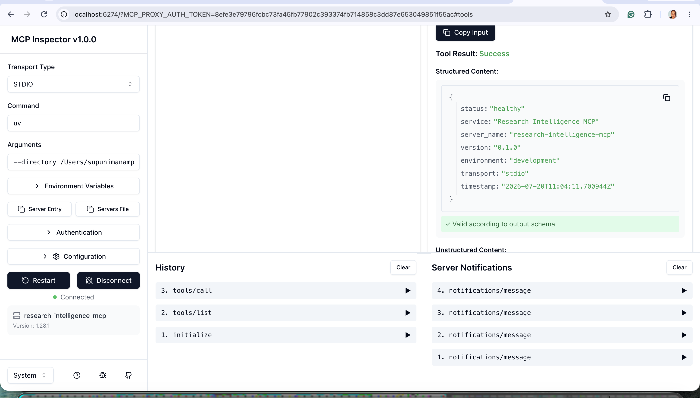

# Research Intelligence MCP

A production-structured Model Context Protocol (MCP) server for academic paper discovery, citation exploration, and research intelligence workflows.

Research Intelligence MCP provides a unified interface over multiple scientific knowledge sources while exposing standardized MCP tools that can be consumed by AI systems such as ChatGPT, Claude Desktop, Cursor, ResearchMind, and custom agents.

---

# Motivation

Modern AI systems increasingly require access to external research knowledge.

Academic information is fragmented across multiple providers:

* Semantic Scholar
* arXiv
* OpenAlex
* CrossRef
* PubMed
* IEEE
* Springer
* Nature

Every provider exposes different APIs, schemas, identifiers, and capabilities.

This project solves that problem by providing:

* Unified paper models
* Provider abstraction
* Search federation
* Citation graph exploration
* Open-access paper resolution
* MCP-compatible tooling

---

# Features

## Current Version

### Academic Search

* Search scientific papers
* Search recent arXiv publications
* Retrieve paper metadata
* Discover related papers
* Retrieve citations and references
* Resolve available open-access PDFs

### Architecture

* Official MCP Python SDK
* Async Python architecture
* Provider abstraction layer
* Canonical domain models
* Structured logging
* Retry policies
* Caching support
* Rate limiting support
* Production-quality project structure

---

# Supported Providers

## Phase 1

* Semantic Scholar
* arXiv

## Planned Providers

* CrossRef
* OpenAlex
* Papers With Code
* PubMed
* IEEE
* Springer Nature

---

# Example Use Cases

## Find recent papers

```text
Find recent papers about Agentic RAG.
```

## Discover related work

```text
Find papers related to LangGraph multi-agent systems.
```

## Citation exploration

```text
What papers cite the original RAG paper?
```

## Open-access resolution

```text
Find the PDF for this research paper.
```

## Research agent integration

```text
ResearchMind
        ↓
Research Intelligence MCP
        ↓
Semantic Scholar
arXiv
```

---

# Architecture

```text
┌──────────────────────┐
│      MCP Tools       │
└──────────┬───────────┘
           │
┌──────────▼───────────┐
│      Services        │
└──────────┬───────────┘
           │
┌──────────▼───────────┐
│ Provider Abstraction │
└──────────┬───────────┘
           │
 ┌─────────┴─────────┐
 │                   │
▼                     ▼
Semantic Scholar     arXiv
```

---

# Project Structure

```text
research-intelligence-mcp/
├── src/
│   └── research_intelligence_mcp/
├── tests/
├── pyproject.toml
├── README.md
└── .env.example
```

---

# Requirements

* Python 3.12+
* uv
* Git

---

# Installation

Clone repository:

```bash
git clone <repository-url>
cd research-intelligence-mcp
```

Create virtual environment:

```bash
uv venv
source .venv/bin/activate
```

Install dependencies:

```bash
uv sync
```

Create environment file:

```bash
cp .env.example .env
```

---

# Running

Run the MCP server:

```bash
uv run research-intelligence-mcp
```

or 
```bash
python -m research_intelligence_mcp
```

---

# Quality Checks

Format:

```bash
uv run ruff format .
```

Lint:

```bash
uv run ruff check .
uv run ruff check . --fix
```

Type checking:

```bash
uv run mypy src
```

Tests:

```bash
uv run pytest
```

---

# MCP Configuration Example

```json
{
  "mcpServers": {
    "research-intelligence-mcp": {
      "command": "uv",
      "args": [
        "--directory",
        "/absolute/path/to/research-intelligence-mcp",
        "run",
        "research-intelligence-mcp"
      ]
    }
  }
}
```

---

# Test using MCP Inspector

The official MCP Inspector is the recommended interactive tool for viewing registered MCP tools, their schemas, parameters, and execution results. project root, run:

```bash
npx @modelcontextprotocol/inspector \
  uv \
  --directory "$(pwd)" \
  run \
  research-intelligence-mcp
```

The Inspector should open in your browser.

Then:
Connect to MCP Server 
Open the Tools tab.
List tools
Select health_check.
Run the tool.

Expected structured result:
```json
{
  "status": "healthy",
  "service": "Research Intelligence MCP",
  "server_name": "research-intelligence-mcp",
  "version": "0.1.0",
  "environment": "development",
  "transport": "stdio",
  "timestamp": "2026-07-20T..."
}
```



---

# License

MIT
