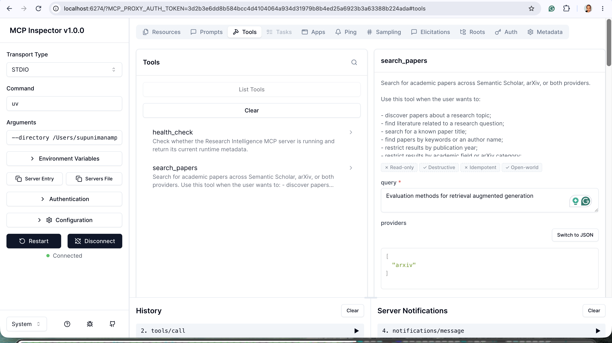
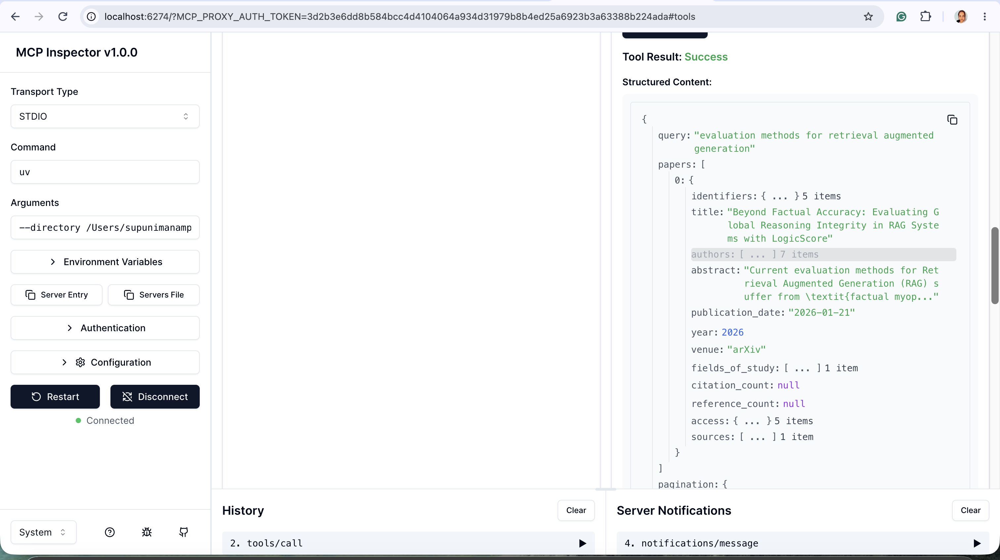

# Research Intelligence MCP

A production-structured Model Context Protocol (MCP) server for academic paper discovery, citation exploration, and research intelligence workflows.

Research Intelligence MCP provides a unified interface over multiple scientific knowledge sources while exposing standardized MCP tools that can be consumed by AI systems such as ChatGPT, Claude Desktop, Cursor, ResearchMind, and custom agents.

---

# Motivation

Modern AI systems increasingly require access to external research knowledge.

Academic information is fragmented across multiple providers:

* Semantic Scholar
* arXiv
* OpenAlex
* CrossRef
* PubMed
* IEEE
* Springer
* Nature

Every provider exposes different APIs, schemas, identifiers, and capabilities.

This project solves that problem by providing:

* Unified paper models
* Provider abstraction
* Search federation
* Citation graph exploration
* Open-access paper resolution
* MCP-compatible tooling

---

# Features

## Current Version

### Academic Search

* Search scientific papers
* Search recent arXiv publications
* Retrieve paper metadata
* Discover related papers
* Retrieve citations and references
* Resolve available open-access PDFs

### Architecture

* Official MCP Python SDK
* Async Python architecture
* Provider abstraction layer
* Canonical domain models
* Structured logging
* Retry policies
* Caching support
* Rate limiting support
* Production-quality project structure

---

# Supported Providers

## Phase 1

* Semantic Scholar
* arXiv

## Planned Providers

* CrossRef
* OpenAlex
* Papers With Code
* PubMed
* IEEE
* Springer Nature

---

# Example Use Cases

## Find recent papers

```text
Find recent papers about Agentic RAG.
```

## Discover related work

```text
Find papers related to LangGraph multi-agent systems.
```

## Citation exploration

```text
What papers cite the original RAG paper?
```

## Open-access resolution

```text
Find the PDF for this research paper.
```

## Research agent integration

```text
ResearchMind
        ↓
Research Intelligence MCP
        ↓
Semantic Scholar
arXiv
```

---

# Architecture

```text
┌──────────────────────┐
│      MCP Tools       │
└──────────┬───────────┘
           │
┌──────────▼───────────┐
│      Services        │
└──────────┬───────────┘
           │
┌──────────▼───────────┐
│ Provider Abstraction │
└──────────┬───────────┘
           │
 ┌─────────┴─────────┐
 │                   │
▼                     ▼
Semantic Scholar     arXiv
```

---

# Project Structure

```text
research-intelligence-mcp/
├── src/
│   └── research_intelligence_mcp/
├── tests/
├── scripts/
│   └── generate_dev_token.py
├── deployment/
│   ├── ecs/
│   │   ├── task-definition.json
│   │   ├── service-connect-example.json
│   │   └── README.md
│   ├── observability/
│   │   ├── prometheus.yml
│   │   └── grafana/
│   └── scripts/
│       ├── smoke_test.py
│       └── wait_for_ready.py
├── Dockerfile
├── .dockerignore
├── docker-compose.yml
├── pyproject.toml
├── README.md
└── .env.example
```

---

# Requirements

* Python 3.12+
* uv
* Git

---

# Installation

Clone repository:

```bash
git clone <repository-url>
cd research-intelligence-mcp
```

Create virtual environment:

```bash
uv venv
source .venv/bin/activate
```

Install dependencies:

```bash
uv sync
```

Create environment file:

```bash
cp .env.example .env
```

---

# Running

Run the MCP server:

```bash
uv run research-intelligence-mcp
```

or 
```bash
python -m research_intelligence_mcp
```

---

# Quality Checks

Format:

```bash
uv run ruff format .
```

Lint:

```bash
uv run ruff check .
uv run ruff check . --fix
```

Type checking:

```bash
uv run mypy src
```

Tests:

```bash
uv run pytest
```

Package build verification: 
```bash
uv build
```

---

# MCP Configuration Example

```json
{
  "mcpServers": {
    "research-intelligence-mcp": {
      "command": "uv",
      "args": [
        "--directory",
        "/absolute/path/to/research-intelligence-mcp",
        "run",
        "research-intelligence-mcp"
      ]
    }
  }
}
```

For full step-by-step instructions covering Claude Desktop, Cursor, MCP
Inspector, and remote `streamable-http` clients (including bearer-JWT
authentication), see
[`docs/research_intelligence_mcp_client_setup.md`](docs/research_intelligence_mcp_client_setup.md).

---

# Test using MCP Inspector

The official MCP Inspector is the recommended interactive tool for viewing registered MCP tools, their schemas, parameters, and execution results. project root, run:

```bash
npx @modelcontextprotocol/inspector \
  uv \
  --directory "$(pwd)" \
  run \
  research-intelligence-mcp
```

The Inspector should open in your browser.

Then:
Connect to MCP Server 
Open the Tools tab.
List tools
Select health_check.
Run the tool.

Expected structured result:
```json
{
  "status": "healthy",
  "service": "Research Intelligence MCP",
  "server_name": "research-intelligence-mcp",
  "version": "0.1.0",
  "environment": "development",
  "transport": "stdio",
  "timestamp": "2026-07-20T..."
}
```


# Startup flow

```
main()
  │
  ├── load settings
  ├── configure stderr logging
  ├── build dependency container
  ├── create FastMCP server
  ├── register tools
  └── run stdio transport
```

# MCP Tools

## Search Tool


---

# Remote Deployment and Authentication

For the full deployment guide (Docker, AWS ECS, secrets, smoke tests, and
the remaining manual AWS steps), see
[`docs/research_intelligence_mcp_deployment_guide.md`](docs/research_intelligence_mcp_deployment_guide.md).
The summary below covers the basics.

`stdio` remains the default local transport and requires no authentication.

For remote deployments (for example, integrating with ResearchMind), the
server also supports a `streamable-http` transport with service-to-service
bearer-JWT authentication:

```bash
MCP_TRANSPORT=streamable-http
AUTH_ENABLED=true
AUTH_ISSUER=https://auth.researchmind.ai
AUTH_AUDIENCE=research-intelligence-mcp
AUTH_JWKS_URL=https://auth.researchmind.ai/.well-known/jwks.json
```

See `docs/research_intelligence_mcp_authentication.md` for the full
architecture, `docs/research_intelligence_mcp_authentication_testing.md`
for a verified step-by-step guide to testing it locally, and
`.env.example` for every `AUTH_*` and `MCP_*` setting.

On `streamable-http`, the server also exposes unauthenticated HTTP routes
alongside `/mcp`:

| Route | Purpose |
|---|---|
| `GET /health` | Liveness only. Never calls Semantic Scholar or arXiv. |
| `GET /ready` | Readiness. Returns `503` once graceful shutdown has begun. |
| `GET /metrics` | Prometheus text format (tool, provider, cache, and HTTP metrics). Keep this endpoint network-private. |

## Container

Build and run the production container:

```bash
docker build -t research-intelligence-mcp:local .

docker run --rm -p 8000:8000 --env-file .env research-intelligence-mcp:local
```

The image defaults to `MCP_TRANSPORT=streamable-http`, binds `0.0.0.0:8000`,
runs as a non-root user, and ships a container-level `HEALTHCHECK` against
`/health`. See `Dockerfile` and `.dockerignore`.

## AWS ECS

Reference (unapplied) task-definition and Service Connect templates,
security-group guidance, and a deployment/rollback runbook live in
`deployment/ecs/README.md`.

## Deployment Smoke Tests

```bash
uv run python deployment/scripts/wait_for_ready.py --base-url http://127.0.0.1:8000
uv run python deployment/scripts/smoke_test.py --base-url http://127.0.0.1:8000
```

`smoke_test.py` checks `/health`, `/ready`, `/metrics`, MCP session
initialization, tool discovery, and an authenticated `health_check` +
`search_papers` call. Pass `--auth-token` when `AUTH_ENABLED=true`.

## Local Observability Stack

### Why

`/metrics` alone is just a text snapshot of counters at the instant you
curl it — it can't tell you if arXiv's error rate spiked five minutes ago,
whether the cache is actually paying for itself, or whether `search_papers`
got slower after a change. That requires something to scrape it
repeatedly, store the history, and let you look at trends instead of one
number. `docker-compose.yml` runs that: the MCP server, Prometheus, and
Grafana, wired together.

```bash
docker compose up -d --build
```

| Service | URL | Role |
|---|---|---|
| Prometheus | http://127.0.0.1:9090 | **Collects and stores metrics.** Scrapes `/metrics` every 15s into a time-series database and answers PromQL queries (`rate(mcp_tool_requests_total[1m])`, etc.). Its own UI is functional, not built for dashboards. |
| Grafana | http://127.0.0.1:3002 | **Visualizes** what Prometheus stored. Has no storage of its own here — it queries Prometheus and renders the results as graphs. Pre-provisioned with a Prometheus datasource and a 10-panel dashboard (**Dashboards → Research Intelligence MCP**, anonymous viewer access, no login needed). |
| MCP server | http://127.0.0.1:8001 | The app itself, on a remapped host port (`8000` is often already in use — change it in `docker-compose.yml` if `8001` collides too). |

In short: Prometheus is the database that remembers metrics over time;
Grafana is the window you look through to see them — neither is useful
here without the other.

### What you can actually do with it

Once traffic flows through (`uv run python deployment/scripts/smoke_test.py --base-url http://127.0.0.1:8001`,
or just use the server), the dashboard's 10 panels let you:

- **Watch tool usage live** — which of the 7 MCP tools are actually being called, at what rate, and how their p95 latency moves over time (`mcp_tool_requests_total`, `mcp_tool_duration_seconds`).
- **Catch failures by cause, per tool** — a spike in `mcp_tool_failures_total{error_type="ValidationError"}` vs. `{error_type="ProviderTransportError"}` tells you immediately whether it's bad input or an upstream outage, without grepping logs.
- **See which provider is the bottleneck or the one failing** — `provider_requests_total` / `provider_failures_total`, broken out by `provider` (Semantic Scholar vs. arXiv) and `operation` (search, get_paper, citations, ...), so you don't have to guess which one is slow or rate-limiting you.
- **Judge whether caching is worth it** — the cache-hit-ratio panel (`cache_hits_total / (hits + misses)`) shows, per cache (search vs. paper), whether repeat lookups are actually being served from memory.
- **Spot HTTP-layer load** — request rate by route/status code and in-flight request count, useful for noticing retries, client misbehavior, or load before it becomes a real incident.
- **Query anything ad hoc in Prometheus directly** (http://127.0.0.1:9090/graph) — the dashboard only covers the panels we pre-built; any of the metric names above can be queried and graphed on the fly with PromQL for a question the dashboard doesn't answer.

This stack is for local development only — it is not deployed as part of
the ECS setup above (nothing collects these metrics in production yet; see
the "remaining manual tasks" in the deployment guide). See
`docs/research_intelligence_mcp_deployment_guide.md` §8 for teardown and
more detail.

---

# License

MIT
