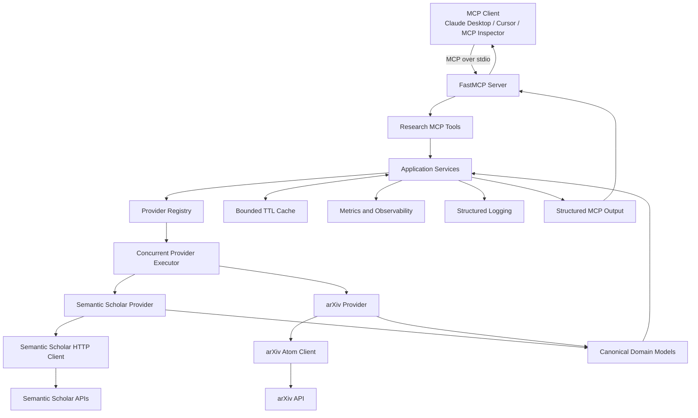
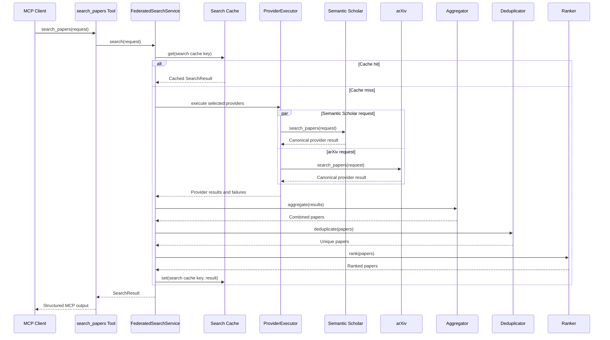
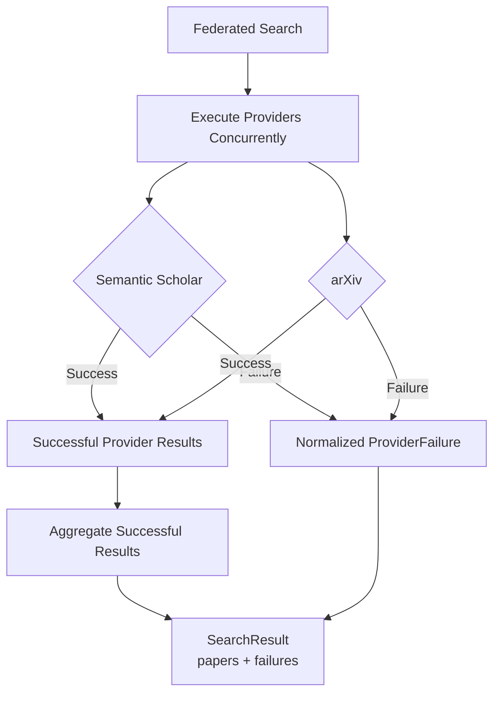
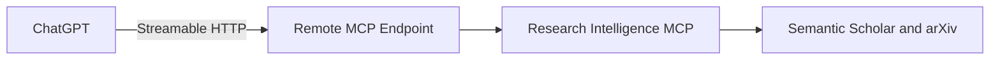
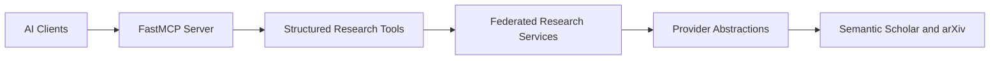

# Research Intelligence MCP

## Project Documentation

**Version:** 0.1.0  
**Runtime:** Python 3.12  
**Protocol:** Model Context Protocol  
**Transport:** stdio  
**Primary providers:** Semantic Scholar and arXiv

---

# 1. Project Overview

Research Intelligence MCP is a production-oriented Model Context Protocol server that gives AI clients structured access to academic research data.

The server provides tools for:

- federated academic-paper search;
- paper metadata retrieval;
- citation and reference retrieval;
- related-paper discovery;
- arXiv-specific search;
- open-access and PDF resolution.

The project currently integrates:

- Semantic Scholar;
- arXiv.

Provider-specific responses are translated into strict, provider-neutral domain models before being exposed through MCP tools.

---

# 2. Architecture Diagram



## Architectural Layers

### MCP layer

Responsible for:

- tool registration;
- validated input schemas;
- structured output schemas;
- safe MCP-facing errors;
- dependency injection into tool handlers.

### Service layer

Responsible for:

- coordinating provider calls;
- federated search;
- partial-failure handling;
- aggregation;
- deduplication;
- deterministic ranking;
- provider attribution.

### Provider layer

Responsible for:

- provider-specific API communication;
- response parsing;
- provider-specific models;
- mapping to canonical domain models;
- provider error normalization.

### Infrastructure layer

Responsible for:

- asynchronous HTTP clients;
- connection pooling;
- rate limiting;
- retry policies;
- TTL caching;
- logging;
- metrics;
- configuration.

### Domain layer

Contains immutable, provider-neutral models such as:

- `Paper`;
- `Author`;
- `PaperIdentifiers`;
- `PaperAccess`;
- `PaperReference`;
- `SearchRequest`;
- `SearchResult`;
- `ProviderFailure`;
- pagination models.

Provider response schemas are not exposed outside provider boundaries.

---

# 3. Provider Flow Diagram

## Federated Search Flow



## Single-Paper Retrieval Flow

```mermaid
flowchart LR
    Request["get_paper Request"]
    Tool["MCP Tool"]
    Service["Paper Retrieval Service"]
    CacheLookup{"Paper Cache Hit?"}
    Registry["Provider Registry"]
    Provider["Selected Provider"]
    Client["Provider Client"]
    API["Provider API"]
    Model["Provider Response Model"]
    Mapper["Provider Mapper"]
    Canonical["Canonical Paper"]
    CacheWrite["Cache Successful Result"]
    Response["Structured MCP Response"]

    Request --> Tool
    Tool --> Service
    Service --> CacheLookup

    CacheLookup -->|Yes| Response
    CacheLookup -->|No| Registry
    Registry --> Provider
    Provider --> Client
    Client --> API
    API --> Model
    Model --> Mapper
    Mapper --> Canonical
    Canonical --> CacheWrite
    CacheWrite --> Response
```



## Partial-Failure Flow



A failure from one provider does not discard valid results returned by another provider.

---

# 4. Tool Catalogue

## Available Tools

| Tool | Purpose | Providers |
|---|---|---|
| `health_check` | Check whether the MCP server is running | Internal |
| `search_papers` | Search one or more academic providers | Semantic Scholar and arXiv |
| `search_arxiv` | Search arXiv directly | arXiv |
| `get_paper` | Retrieve canonical metadata for one paper | Semantic Scholar and arXiv |
| `get_paper_citations` | Retrieve papers that cite a paper | Semantic Scholar |
| `get_paper_references` | Retrieve papers referenced by a paper | Semantic Scholar |
| `get_related_papers` | Find related or recommended papers | Semantic Scholar |
| `resolve_paper_access` | Resolve open-access status and document URLs | Semantic Scholar and arXiv |

---

## `health_check`

Checks whether the MCP server is running and able to respond.

### Example input

```json
{}
```

### Example output

```json
{
  "status": "healthy",
  "service": "research-intelligence-mcp",
  "version": "0.1.0"
}
```

---

## `search_papers`

Searches Semantic Scholar, arXiv, or both providers.

The tool performs:

1. provider selection;
2. concurrent execution;
3. partial-failure preservation;
4. result aggregation;
5. paper deduplication;
6. deterministic ranking;
7. provider attribution.

### Example input

```json
{
  "query": "retrieval augmented generation for scientific research",
  "providers": [
    "semantic_scholar",
    "arxiv"
  ],
  "limit": 5
}
```

### Example output

```json
{
  "papers": [
    {
      "title": "Example Research Paper",
      "abstract": "Example abstract...",
      "authors": [
        {
          "name": "Example Author"
        }
      ],
      "identifiers": {
        "doi": "10.0000/example",
        "arxiv_id": "2401.00001"
      },
      "publication_year": 2024,
      "providers": [
        "semantic_scholar",
        "arxiv"
      ],
      "access": {
        "is_open_access": true,
        "pdf_url": "https://arxiv.org/pdf/2401.00001"
      }
    }
  ],
  "failures": [],
  "pagination": {
    "limit": 5,
    "returned": 1
  }
}
```

### Limitations

- Canonical field-of-study filters are not yet translated for every provider.
- Semantic Scholar may enforce stricter rate limits when no API key is configured.
- Results depend on metadata made available by the upstream providers.

---

## `search_arxiv`

Searches only the arXiv provider.

### Example input

```json
{
  "query": "large language model agents",
  "limit": 10
}
```

### Example output

```json
{
  "papers": [
    {
      "title": "Example arXiv Paper",
      "identifiers": {
        "arxiv_id": "2401.00001"
      },
      "providers": [
        "arxiv"
      ],
      "access": {
        "is_open_access": true,
        "abstract_url": "https://arxiv.org/abs/2401.00001",
        "pdf_url": "https://arxiv.org/pdf/2401.00001"
      }
    }
  ],
  "failures": []
}
```

---

## `get_paper`

Retrieves metadata for a paper using a supported identifier.

Supported identifiers may include:

- DOI;
- arXiv ID;
- Semantic Scholar paper ID;
- Semantic Scholar corpus ID.

### Example input using an arXiv ID

```json
{
  "paper_id": "2401.00001",
  "provider": "arxiv"
}
```

### Example input using a DOI

```json
{
  "paper_id": "10.0000/example",
  "provider": "semantic_scholar"
}
```

### Example output

```json
{
  "paper": {
    "title": "Example Paper",
    "abstract": "Example abstract...",
    "authors": [
      {
        "name": "Example Author"
      }
    ],
    "identifiers": {
      "doi": "10.0000/example",
      "arxiv_id": "2401.00001"
    },
    "publication_year": 2024,
    "providers": [
      "semantic_scholar"
    ]
  }
}
```

---

## `get_paper_citations`

Retrieves papers that cite the requested paper.

### Provider support

- Semantic Scholar: supported
- arXiv: unsupported

### Example input

```json
{
  "paper_id": "10.0000/example",
  "provider": "semantic_scholar",
  "limit": 20
}
```

### Example output

```json
{
  "paper_id": "10.0000/example",
  "citations": [
    {
      "relationship": "citation",
      "paper": {
        "title": "Paper Citing the Requested Work",
        "identifiers": {
          "doi": "10.0000/citing-paper"
        },
        "providers": [
          "semantic_scholar"
        ]
      }
    }
  ]
}
```

---

## `get_paper_references`

Retrieves papers referenced by the requested paper.

### Provider support

- Semantic Scholar: supported
- arXiv: unsupported

### Example input

```json
{
  "paper_id": "10.0000/example",
  "provider": "semantic_scholar",
  "limit": 20
}
```

### Example output

```json
{
  "paper_id": "10.0000/example",
  "references": [
    {
      "relationship": "reference",
      "paper": {
        "title": "Referenced Paper",
        "identifiers": {
          "doi": "10.0000/referenced-paper"
        },
        "providers": [
          "semantic_scholar"
        ]
      }
    }
  ]
}
```

---

## `get_related_papers`

Finds papers related to the requested paper.

### Provider support

- Semantic Scholar: supported
- arXiv: unsupported

### Example input

```json
{
  "paper_id": "10.0000/example",
  "provider": "semantic_scholar",
  "limit": 10
}
```

### Example output

```json
{
  "paper_id": "10.0000/example",
  "papers": [
    {
      "title": "Related Research Paper",
      "identifiers": {
        "doi": "10.0000/related"
      },
      "providers": [
        "semantic_scholar"
      ]
    }
  ]
}
```

---

## `resolve_paper_access`

Resolves open-access information, abstract pages, and PDF URLs.

### Example input

```json
{
  "paper_id": "2401.00001",
  "provider": "arxiv"
}
```

### Example output

```json
{
  "paper_id": "2401.00001",
  "access": {
    "is_open_access": true,
    "abstract_url": "https://arxiv.org/abs/2401.00001",
    "pdf_url": "https://arxiv.org/pdf/2401.00001"
  }
}
```

---

# 5. MCP Inspector Instructions

The MCP Inspector is an interactive tool for discovering, invoking, and debugging MCP tools. It supports local stdio servers as well as remote MCP transports.

## Prerequisites

Install project dependencies:

```bash
uv sync
```

Confirm that the server starts:

```bash
uv run python -m research_intelligence_mcp
```

The command will wait for MCP messages through standard input. This is expected for a stdio server.

Do not use ordinary `print()` calls in the server because stdout is reserved for MCP JSON-RPC communication. Application logs must be written to stderr.

## Start MCP Inspector

From the repository root:

```bash
npx @modelcontextprotocol/inspector \
  uv \
  --directory "$(pwd)" \
  run \
  python \
  -m \
  research_intelligence_mcp
```

Alternatively, start Inspector without a preconfigured server:

```bash
npx @modelcontextprotocol/inspector
```

Then configure the server in the Inspector interface.

### Command

```text
uv
```

### Arguments

```text
--directory
/ABSOLUTE/PATH/TO/research-intelligence-mcp
run
python
-m
research_intelligence_mcp
```

## Validation Steps

1. Open the Inspector URL shown in the terminal.
2. Connect to the MCP server.
3. Open the **Tools** section.
4. Confirm that all expected tools are listed.
5. Select a tool.
6. Inspect its input schema.
7. provide valid input.
8. invoke the tool;
9. inspect structured output and error responses.

## Recommended Inspector Tests

### Health check

```json
{}
```

### Federated search

```json
{
  "query": "retrieval augmented generation",
  "providers": [
    "semantic_scholar",
    "arxiv"
  ],
  "limit": 5
}
```

### arXiv paper retrieval

```json
{
  "paper_id": "2401.00001",
  "provider": "arxiv"
}
```

### Validation failure

Provide a limit outside the accepted range and verify that the tool returns a structured validation error rather than an unhandled exception.

## Troubleshooting

### The server disconnects immediately

Check that:

- the absolute project path is correct;
- `uv sync` completed successfully;
- Python 3.12 is active;
- the package can be imported;
- no code writes application logs to stdout.

### Tools are missing

Run:

```bash
uv run python -m research_intelligence_mcp
```

Then confirm that:

- tool registration is executed by the server factory;
- the correct module entry point is used;
- startup did not fail while constructing dependencies.

### Provider requests fail

Check:

- internet connectivity;
- provider rate limits;
- environment variables;
- optional Semantic Scholar API-key configuration;
- stderr logs.

---

# 6. Claude Desktop Configuration

Claude Desktop can launch local MCP servers using stdio.

## Prerequisites

From the project root:

```bash
uv sync
```

Find the absolute path:

```bash
pwd
```

Example:

```text
/Users/your-name/projects/research-intelligence-mcp
```

## Configuration

Open the Claude Desktop MCP configuration file and add:

```json
{
  "mcpServers": {
    "research-intelligence": {
      "command": "uv",
      "args": [
        "--directory",
        "/ABSOLUTE/PATH/TO/research-intelligence-mcp",
        "run",
        "python",
        "-m",
        "research_intelligence_mcp"
      ],
      "env": {
        "APP_ENV": "development",
        "MCP_TRANSPORT": "stdio"
      }
    }
  }
}
```

Replace:

```text
/ABSOLUTE/PATH/TO/research-intelligence-mcp
```

with the actual repository path.

When an optional Semantic Scholar API key is available, it can be supplied through the environment:

```json
{
  "mcpServers": {
    "research-intelligence": {
      "command": "uv",
      "args": [
        "--directory",
        "/ABSOLUTE/PATH/TO/research-intelligence-mcp",
        "run",
        "python",
        "-m",
        "research_intelligence_mcp"
      ],
      "env": {
        "APP_ENV": "development",
        "MCP_TRANSPORT": "stdio",
        "SEMANTIC_SCHOLAR_API_KEY": "YOUR_API_KEY"
      }
    }
  }
}
```

Do not commit a configuration file containing real API keys.

## Restart Claude Desktop

After updating the configuration:

1. completely quit Claude Desktop;
2. start Claude Desktop again;
3. open the integrations or tools interface;
4. confirm that `research-intelligence` is connected;
5. confirm that the research tools are visible.

## Example Prompts

```text
Search Semantic Scholar and arXiv for recent papers about agentic RAG.
```

```text
Find five papers about query decomposition in retrieval-augmented generation.
```

```text
Get the metadata and open-access URL for arXiv paper 2401.00001.
```

```text
Find papers related to DOI 10.0000/example.
```

## Common Problems

### `uv` is not found

Use the absolute path returned by:

```bash
which uv
```

Example:

```json
{
  "command": "/Users/your-name/.local/bin/uv"
}
```

### Project dependencies cannot be found

Make sure the configuration includes:

```text
--directory
/ABSOLUTE/PATH/TO/research-intelligence-mcp
```

### The server appears connected but tools fail

Inspect the Claude Desktop MCP logs and the server's stderr output.

---

# 7. ChatGPT-Compatible Integration Guidance

The current project uses a local stdio MCP transport.

ChatGPT integration requires a remotely accessible MCP server rather than directly launching the local stdio process. OpenAI's MCP and Apps SDK documentation describes connecting ChatGPT to remote MCP endpoints. Therefore, the existing stdio server should not be presented as directly connectable to ChatGPT without an additional remote transport and deployment layer.

## Current Compatibility

| Integration path | Current support |
|---|---|
| Local stdio server directly from ChatGPT | Not supported by this project |
| Remote MCP server | Requires implementation and deployment |
| OpenAI Apps SDK | Possible future integration |
| ResearchMind as an MCP client | Planned |
| OpenAI API remote MCP tool | Possible after remote deployment |

## Recommended Future Architecture



## Required Work for Direct ChatGPT Integration

1. Add Streamable HTTP transport.
2. Deploy the MCP server to a public HTTPS endpoint.
3. Add authentication where private or user-specific capabilities exist.
4. Configure allowed origins and transport security.
5. expose an MCP endpoint such as:

```text
https://research.example.com/mcp
```

6. Validate tools through a remote MCP client.
7. Register or connect the endpoint through the supported ChatGPT Apps or connector workflow.
8. Review OpenAI tool metadata and authentication requirements.

## Apps SDK Path

The project could later be extended into a ChatGPT app using:

```text
ChatGPT
   │
   ▼
OpenAI Apps SDK
   │
   ▼
Remote Research Intelligence MCP Server
   │
   ├── Semantic Scholar
   └── arXiv
```

The existing canonical models and MCP tool schemas provide a strong backend foundation. A future Apps SDK version could additionally provide:

- interactive paper result cards;
- citation graph views;
- paper-comparison interfaces;
- download and open-access actions;
- provider status indicators.

## OpenAI API Path

After deploying a remote MCP endpoint, an application using the OpenAI API could expose the MCP server as a remote tool.

The application, not the model, should remain responsible for:

- selecting trusted MCP servers;
- managing authentication;
- approving sensitive tool calls;
- validating tool results;
- recording audit and usage information.

---

# 8. Cursor Configuration

Cursor can be configured to launch a local MCP server.

## Project Configuration

Create or update:

```text
.cursor/mcp.json
```

Use:

```json
{
  "mcpServers": {
    "research-intelligence": {
      "command": "uv",
      "args": [
        "--directory",
        "/ABSOLUTE/PATH/TO/research-intelligence-mcp",
        "run",
        "python",
        "-m",
        "research_intelligence_mcp"
      ],
      "env": {
        "APP_ENV": "development",
        "MCP_TRANSPORT": "stdio"
      }
    }
  }
}
```

Replace the project path with the repository's absolute path.

## Optional Semantic Scholar API Key

```json
{
  "mcpServers": {
    "research-intelligence": {
      "command": "uv",
      "args": [
        "--directory",
        "/ABSOLUTE/PATH/TO/research-intelligence-mcp",
        "run",
        "python",
        "-m",
        "research_intelligence_mcp"
      ],
      "env": {
        "APP_ENV": "development",
        "MCP_TRANSPORT": "stdio",
        "SEMANTIC_SCHOLAR_API_KEY": "YOUR_API_KEY"
      }
    }
  }
}
```

Do not commit real credentials.

## Validation

1. Restart Cursor.
2. Open Cursor MCP settings.
3. Confirm that `research-intelligence` is connected.
4. Confirm that the tools are listed.
5. Ask Cursor to perform a research search.

## Example Prompts

```text
Use the research-intelligence MCP tools to find papers about hybrid retrieval.
```

```text
Search arXiv for papers about LangGraph agent orchestration.
```

```text
Find papers related to a given DOI and summarize their metadata.
```

## Troubleshooting

### Server process cannot start

Check:

```bash
which uv
```

Use the absolute `uv` path in the configuration when necessary.

### Import errors

Run:

```bash
uv sync
uv run python -c "import research_intelligence_mcp"
```

### Tools are not visible

Confirm that:

- `.cursor/mcp.json` contains valid JSON;
- Cursor was restarted;
- the project path is absolute;
- the MCP server starts without errors.

---

# 9. Example Tool Calls and Outputs

The exact wrapper displayed by an MCP client may differ, but the structured tool arguments and results follow the same domain contracts.

## Example 1: Federated Search

### Request

```json
{
  "query": "agentic retrieval augmented generation",
  "providers": [
    "semantic_scholar",
    "arxiv"
  ],
  "limit": 5
}
```

### Response

```json
{
  "papers": [
    {
      "title": "Agentic Retrieval-Augmented Generation",
      "abstract": "This paper studies...",
      "authors": [
        {
          "name": "Jane Researcher"
        },
        {
          "name": "John Author"
        }
      ],
      "identifiers": {
        "doi": "10.0000/example",
        "arxiv_id": "2401.00001"
      },
      "publication_year": 2024,
      "providers": [
        "semantic_scholar",
        "arxiv"
      ],
      "access": {
        "is_open_access": true,
        "abstract_url": "https://arxiv.org/abs/2401.00001",
        "pdf_url": "https://arxiv.org/pdf/2401.00001"
      }
    }
  ],
  "failures": [],
  "pagination": {
    "limit": 5,
    "returned": 1
  }
}
```

---

## Example 2: Partial Provider Failure

### Request

```json
{
  "query": "scientific question answering",
  "providers": [
    "semantic_scholar",
    "arxiv"
  ],
  "limit": 5
}
```

### Response

```json
{
  "papers": [
    {
      "title": "Scientific Question Answering with Retrieval",
      "identifiers": {
        "arxiv_id": "2401.00002"
      },
      "providers": [
        "arxiv"
      ],
      "access": {
        "is_open_access": true,
        "pdf_url": "https://arxiv.org/pdf/2401.00002"
      }
    }
  ],
  "failures": [
    {
      "provider": "semantic_scholar",
      "error_type": "rate_limit",
      "message": "The provider rate limit was reached.",
      "retryable": true
    }
  ],
  "pagination": {
    "limit": 5,
    "returned": 1
  }
}
```

Successful arXiv results are preserved even when Semantic Scholar fails.

---

## Example 3: Get an arXiv Paper

### Request

```json
{
  "paper_id": "2401.00001",
  "provider": "arxiv"
}
```

### Response

```json
{
  "paper": {
    "title": "Example arXiv Paper",
    "abstract": "This paper presents...",
    "authors": [
      {
        "name": "Example Author"
      }
    ],
    "identifiers": {
      "arxiv_id": "2401.00001"
    },
    "providers": [
      "arxiv"
    ],
    "access": {
      "is_open_access": true,
      "abstract_url": "https://arxiv.org/abs/2401.00001",
      "pdf_url": "https://arxiv.org/pdf/2401.00001"
    }
  }
}
```

---

## Example 4: Retrieve Citations

### Request

```json
{
  "paper_id": "10.0000/example",
  "provider": "semantic_scholar",
  "limit": 10
}
```

### Response

```json
{
  "paper_id": "10.0000/example",
  "citations": [
    {
      "relationship": "citation",
      "paper": {
        "title": "A Paper That Cites the Requested Work",
        "identifiers": {
          "doi": "10.0000/citing-paper"
        },
        "providers": [
          "semantic_scholar"
        ]
      }
    }
  ]
}
```

---

## Example 5: Unsupported Provider Capability

### Request

```json
{
  "paper_id": "2401.00001",
  "provider": "arxiv",
  "limit": 10
}
```

### Citation Response

```json
{
  "error": {
    "provider": "arxiv",
    "error_type": "unsupported_operation",
    "message": "The arXiv provider does not support citation retrieval.",
    "retryable": false
  }
}
```

---

## Example 6: Resolve Open Access

### Request

```json
{
  "paper_id": "2401.00001",
  "provider": "arxiv"
}
```

### Response

```json
{
  "paper_id": "2401.00001",
  "access": {
    "is_open_access": true,
    "abstract_url": "https://arxiv.org/abs/2401.00001",
    "pdf_url": "https://arxiv.org/pdf/2401.00001"
  }
}
```

---

# 10. Development Guide

## Requirements

- Python 3.12
- `uv`
- Git
- Node.js and `npx` for MCP Inspector

## Install the Project

Clone the repository:

```bash
git clone <REPOSITORY_URL>
cd research-intelligence-mcp
```

Install dependencies:

```bash
uv sync
```

Copy the environment template:

```bash
cp .env.example .env
```

Update values when required.

## Run the Server

```bash
uv run python -m research_intelligence_mcp
```

Because the default transport is stdio, the process waits for MCP requests.

## Run the Health Check Through MCP Inspector

```bash
npx @modelcontextprotocol/inspector \
  uv \
  --directory "$(pwd)" \
  run \
  python \
  -m \
  research_intelligence_mcp
```

## Project Structure

```text
src/research_intelligence_mcp/
├── config/
│   └── Application configuration
├── domain/
│   └── Canonical provider-neutral models
├── infrastructure/
│   ├── auth/
│   │   └── JWT bearer-token verification (streamable-http transport)
│   ├── cache/
│   ├── HTTP infrastructure
│   ├── rate limiting
│   └── logging
├── providers/
│   ├── semantic_scholar/
│   ├── arxiv/
│   ├── cached.py
│   └── Provider abstractions
├── services/
│   └── Search, aggregation, ranking, and orchestration
├── mcp/
│   ├── Tool registration
│   ├── Tool schemas
│   ├── observability.py (request correlation, caller-context propagation)
│   └── Dependency composition
├── __main__.py
└── main.py

tests/
├── unit/
├── integration/
└── fixtures/
```

## Architecture Rules

### Domain models

- must remain provider-neutral;
- must use strict validation;
- must reject unsupported fields where configured;
- must be safe for MCP structured output;
- must not import provider response types.

### Provider implementations

- must return canonical domain models;
- must normalize provider errors;
- must not expose raw HTTP responses;
- must use the shared HTTP infrastructure;
- must respect provider-specific rate limits;
- must use retry policies only for retryable failures.

### Services

- must depend on abstractions rather than provider clients;
- must preserve partial successes;
- must remain independent of MCP transport details;
- must use deterministic aggregation and ranking.

### MCP tools

- must use validated input models;
- must return structured output models;
- must not contain provider HTTP logic;
- must not perform LLM reasoning;
- must expose safe, actionable errors.

## Adding a New Provider

Use this sequence:

1. Add provider settings.
2. Create provider-specific response models.
3. Implement the asynchronous client.
4. Implement the provider mapper.
5. Implement the provider abstraction.
6. Normalize provider errors.
7. Register the provider in the dependency composition root.
8. Add provider capabilities to the registry.
9. Add mapper unit tests.
10. Add mocked provider integration tests.
11. Add service-level tests.
12. Validate through MCP Inspector.

## Caching

The application uses bounded in-memory TTL caches.

Separate policies are used for:

- search results;
- individual paper metadata.

Caching behavior includes:

- deterministic cache keys;
- bounded capacity;
- TTL expiration;
- least-recently-used eviction;
- asynchronous lock protection;
- hit and miss statistics;
- successful-response-only caching.

Provider exceptions and failed responses must not be cached.

## Code Quality Commands

Format:

```bash
uv run ruff format src tests
```

Lint:

```bash
uv run ruff check src tests
```

Type check:

```bash
uv run mypy src
```

Run tests:

```bash
uv run pytest
```

Build:

```bash
uv build
```

## Full Local Quality Gate

```bash
uv run ruff format --check src tests
uv run ruff check src tests
uv run mypy src
uv run pytest
uv build
```

---

# 11. Testing Guide

The test suite is divided into unit and integration tests.

## Run All Tests

```bash
uv run pytest
```

## Run Unit Tests

```bash
uv run pytest tests/unit
```

## Run Integration Tests

```bash
uv run pytest tests/integration
```

## Run One Test File

```bash
uv run pytest tests/unit/infrastructure/cache/test_ttl.py
```

## Run One Test

```bash
uv run pytest \
  tests/unit/infrastructure/cache/test_ttl.py::test_cache_returns_stored_value
```

## Verbose Output

```bash
uv run pytest -vv
```

## Stop After First Failure

```bash
uv run pytest -x
```

## Test Categories

### Domain-model tests

Validate:

- strict field validation;
- identifier normalization;
- immutable behavior;
- JSON serialization;
- JSON round trips;
- generated JSON Schema.

### Provider mapper tests

Validate:

- provider-to-canonical conversion;
- missing optional fields;
- URL normalization;
- DOI normalization;
- arXiv version normalization;
- open-access metadata.

### Provider client tests

Validate:

- request URLs;
- headers;
- query parameters;
- timeout behavior;
- authentication behavior;
- rate-limit responses;
- retryable failures;
- malformed provider payloads.

External providers should be mocked for deterministic automated testing.

### Service tests

Validate:

- provider selection;
- concurrent provider execution;
- partial failures;
- aggregation;
- deduplication;
- deterministic ranking;
- provider attribution.

### Cache tests

Validate:

- cache hits;
- cache misses;
- expiration;
- least-recently-used eviction;
- delete and clear behavior;
- cache statistics;
- exception bypass;
- configuration validation.

### MCP tool tests

Validate:

- tool registration;
- discoverability;
- input schemas;
- validation failures;
- structured outputs;
- safe error handling;
- dependency injection.

### Integration tests

Validate multiple layers together without relying on live provider availability.

For example:

```text
MCP tool
  → service
  → cached provider
  → mocked HTTP client
  → provider mapper
  → canonical output
```

## Optional Live Tests

Live-provider tests should be:

- optional;
- separately marked;
- disabled in normal CI;
- tolerant of provider availability and rate limits;
- prohibited from exposing secrets.

Example:

```bash
uv run pytest -m live
```

## Quality Gate

Before merging a change, run:

```bash
uv run ruff format --check src tests
uv run ruff check src tests
uv run mypy src
uv run pytest
uv build
```

---

# 12. Security Considerations

## Security Model

Research Intelligence MCP is primarily a local stdio MCP server.

The MCP client launches the process and communicates with it through standard input and standard output.

The server accesses external academic APIs and returns structured research metadata. It does not currently execute arbitrary commands, modify user files, or perform autonomous actions.

## Secrets

Secrets must be supplied through environment variables.

Examples include:

- Semantic Scholar API keys;
- future provider credentials;
- remote transport authentication settings (`AUTH_JWT_SECRET`).

Requirements:

- never commit `.env`;
- never commit desktop-client configurations containing secrets;
- never log API keys;
- never log authorization headers;
- never expose secrets in MCP error responses.

## stdio Safety

For a stdio MCP server:

- stdout is reserved for MCP JSON-RPC messages;
- application logs must go to stderr;
- ordinary `print()` calls must not be introduced into runtime code;
- provider response payloads should not be dumped indiscriminately.

Writing non-protocol data to stdout can corrupt the MCP connection.

## Input Validation

Every public MCP tool input must use strict validation.

User-controlled values must be bounded, including:

- result limits;
- pagination values;
- query length;
- provider lists;
- identifier length;
- retry-related configuration.

Unknown or unsupported fields should be rejected or handled explicitly.

## XML Security

arXiv responses use Atom XML.

Untrusted XML must be parsed using safe XML tooling.

The project uses `defusedxml` to reduce risks such as:

- entity expansion;
- external entity resolution;
- XML bomb attacks.

## Provider Isolation

Upstream provider failures must be normalized.

MCP clients must not receive:

- raw stack traces;
- raw HTTP client exceptions;
- authorization headers;
- full provider response dumps;
- internal network details.

Safe errors should include only actionable fields such as:

```json
{
  "provider": "semantic_scholar",
  "error_type": "rate_limit",
  "message": "The provider rate limit was reached.",
  "retryable": true
}
```

## Network Security

The server should:

- use HTTPS provider endpoints;
- configure explicit timeouts;
- use bounded connection pools;
- avoid unrestricted redirect behavior;
- validate provider responses;
- use retry only for appropriate failure classes.

## Rate Limiting

Provider-aware client-side rate limiting protects:

- upstream providers;
- local resources;
- application reliability.

A provider's documented or observed limits should not be bypassed.

## Caching Security

The in-memory cache must:

- have bounded capacity;
- use TTL expiration;
- avoid caching failures;
- avoid including credentials in cache keys;
- avoid logging complete cache values;
- be cleared during application shutdown where appropriate.

Current cached data consists of public academic metadata, not user-private content.

## Dependency Security

Dependencies should be:

- maintained;
- necessary;
- version constrained;
- captured in `uv.lock`;
- reviewed before introduction.

Recommended CI checks include:

```bash
uv run pip-audit
```

and secret scanning using a tool such as:

```bash
gitleaks detect
```

## Logging

Logs should contain operational metadata rather than sensitive payloads.

Acceptable fields include:

- provider name;
- operation name;
- duration;
- result count;
- retry count;
- normalized error type;
- correlation ID.

Avoid logging:

- API keys;
- authorization headers;
- complete provider payloads;
- unnecessarily long user queries;
- environment-variable dumps.

## Authentication

The server supports two authentication postures, selected through
configuration (see `docs/research_intelligence_mcp_authentication.md` for
the full architecture):

- **stdio (default, local):** no authentication. The MCP client launches
  the process directly, so no network-facing auth surface exists.
- **streamable-http (remote, e.g. ResearchMind integration):** bearer-JWT
  verification via `AUTH_ENABLED` and related `AUTH_*` settings. Tokens are
  verified for signature (JWKS or shared secret), expiry, issuer, and
  audience; required scopes are enforced by the MCP SDK's own auth
  middleware. Enabling auth requires no change to `MCP_TRANSPORT=stdio`
  deployments — the two are independent settings, and `stdio` never routes
  through the HTTP auth layer regardless of `AUTH_ENABLED`.

This covers Stage 2 of the authentication roadmap. Stage 3 (public OAuth for
third-party clients) is not implemented.

For a verified walkthrough of configuring and testing Stage 2 locally,
including a dev token-minting helper (`scripts/generate_dev_token.py`) and
troubleshooting, see
`docs/research_intelligence_mcp_authentication_testing.md`.

## Remote Deployment

Before exposing the MCP server through Streamable HTTP:

1. ✅ authentication — service-to-service bearer-JWT verification (`AUTH_*` settings);
2. require HTTPS (deploy behind a TLS-terminating proxy or load balancer; the
   application itself does not terminate TLS);
3. define trusted origins;
4. authorization beyond scope checks (per-tool or per-tenant policy);
5. add request-level rate limiting;
6. isolate tenants where relevant;
7. record auditable tool activity;
8. validate remote transport limits;
9. configure secret storage (e.g. a managed secrets manager rather than `.env` in production);
10. perform a threat-model review.

---

# 13. Portfolio Case Study

## Research Intelligence MCP

### A Production-Oriented Academic Research MCP Server

## Problem

Academic research data is distributed across multiple providers.

Each provider has different:

- APIs;
- response formats;
- identifiers;
- pagination models;
- rate limits;
- search capabilities;
- citation capabilities;
- access metadata.

AI applications that need research information often require custom integrations for every provider. These integrations can expose provider-specific schemas, handle failures inconsistently, and tightly couple application logic to upstream APIs.

## Solution

Research Intelligence MCP provides a standardized academic-research capability through the Model Context Protocol.

It exposes structured tools that AI clients can use to:

- search academic papers;
- retrieve paper metadata;
- inspect citations and references;
- discover related research;
- resolve open-access and PDF information.

The first release integrates Semantic Scholar and arXiv while keeping the architecture extensible for future providers such as OpenAlex, Crossref, and PubMed.

## Core Architecture



## Engineering Highlights

### Provider-neutral domain model

Semantic Scholar returns JSON while arXiv returns Atom XML. Both are mapped into the same canonical models.

This prevents provider schemas from leaking into MCP tools and application services.

### Federated search

A single search can query multiple providers concurrently.

The service:

1. executes providers concurrently;
2. preserves successful results;
3. records normalized provider failures;
4. aggregates papers;
5. deduplicates matching records;
6. applies deterministic ranking;
7. returns provider provenance.

### Partial-failure handling

A Semantic Scholar rate-limit error does not discard valid arXiv results.

The response can contain both:

- successful papers;
- structured provider failures.

### Strong validation

Pydantic models provide:

- strict input validation;
- stable output schemas;
- identifier normalization;
- JSON serialization;
- generated JSON Schema;
- unknown-field handling.

### Reliability

The provider infrastructure includes:

- asynchronous HTTP communication;
- connection pooling;
- explicit timeouts;
- retry policies;
- exponential backoff with jitter;
- `Retry-After` handling;
- provider-aware rate limiting;
- graceful shutdown.

### Bounded caching

The server includes separate in-memory caches for:

- search results;
- paper metadata.

The cache implementation supports:

- TTL expiration;
- bounded capacity;
- least-recently-used eviction;
- deterministic cache keys;
- asynchronous access protection;
- cache statistics;
- successful-response-only caching.

### Safe XML parsing

arXiv Atom feeds are parsed using hardened XML tooling rather than unsafe default XML parsing.

### Dependency injection

Providers, services, caches, configuration, and server dependencies are constructed through an explicit composition root.

Infrastructure is not initialized implicitly when modules are imported.

### Quality standards

The project uses:

- Python 3.12;
- `uv`;
- Ruff;
- strict Mypy;
- Pytest;
- mocked provider integration tests;
- package-build verification.

The project contains more than 157 automated tests, with additional tests added as infrastructure and MCP tools evolve.

## Main MCP Tools

- `health_check`
- `search_papers`
- `search_arxiv`
- `get_paper`
- `get_paper_citations`
- `get_paper_references`
- `get_related_papers`
- `resolve_paper_access`

## Technology Stack

| Area | Technology |
|---|---|
| Language | Python 3.12 |
| MCP framework | FastMCP / official MCP Python SDK |
| Validation | Pydantic v2 |
| Configuration | pydantic-settings |
| HTTP | httpx |
| Retry | tenacity |
| XML security | defusedxml |
| Caching | cachetools |
| Logging | structlog |
| Testing | pytest and respx |
| Linting | Ruff |
| Type checking | Mypy |
| Dependency management | uv |

## Key Design Decisions

### Limit initial provider scope

The first version focuses on Semantic Scholar and arXiv instead of adding many shallow integrations.

This allowed deeper implementation of:

- canonical mapping;
- provider isolation;
- failure normalization;
- testing;
- caching;
- reliability.

### Keep tools deterministic

The MCP server retrieves and structures research data.

It does not perform:

- LLM reasoning;
- report generation;
- autonomous research planning;
- unsupported inference over provider metadata.

Reasoning and report generation belong to the consuming AI application, such as ResearchMind.

### Preserve provenance

Papers retain provider attribution after aggregation and deduplication.

This enables consuming applications to understand where metadata originated.

## Challenges Solved

### Different identifiers

The project normalizes:

- DOI;
- arXiv ID;
- Semantic Scholar paper ID;
- corpus ID.

### Different response formats

Semantic Scholar JSON and arXiv Atom XML are converted into common canonical models.

### Partial provider availability

Federated search continues when one provider fails.

### Upstream rate limits

The server applies client-side rate limiting, retries, and structured rate-limit errors.

### Duplicate records

Identifier-based matching is preferred, with metadata-based fallback where needed.

## Current Limitations

- Citation, reference, and recommendation tools currently depend on Semantic Scholar.
- arXiv does not provide equivalent citation graph operations through the current provider API.
- Provider-aware field-of-study translation remains deferred.
- Some Semantic Scholar graph payloads require further normalization.
- The current transport is local stdio.
- Direct ChatGPT integration requires a remote MCP deployment.

## Future Roadmap

Planned improvements include:

- request correlation IDs;
- structured provider metrics;
- logging security review;
- graceful-shutdown verification;
- GitHub Actions;
- dependency vulnerability scanning;
- secret scanning;
- OpenAlex and Crossref providers;
- remote Streamable HTTP transport;
- ResearchMind integration;
- citation provenance across research workflows.

It is designed as reusable AI infrastructure rather than a single-purpose MCP.

