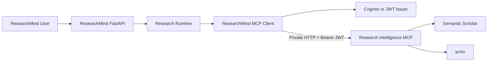
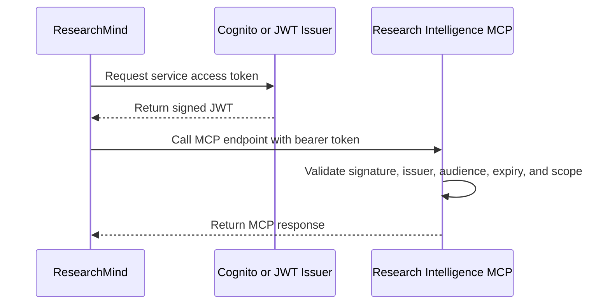
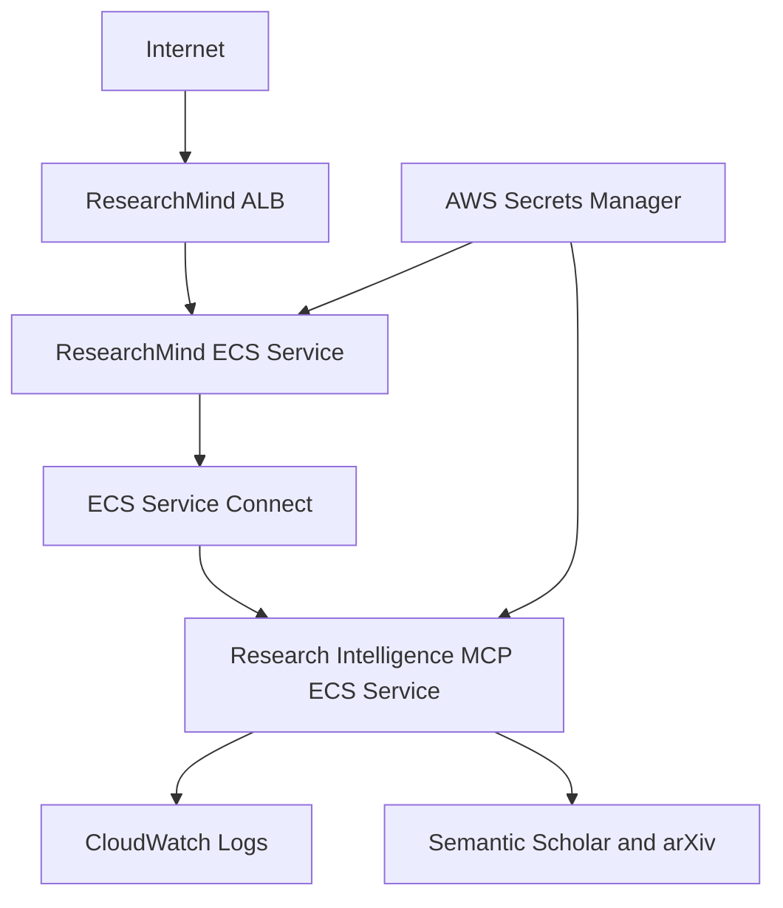
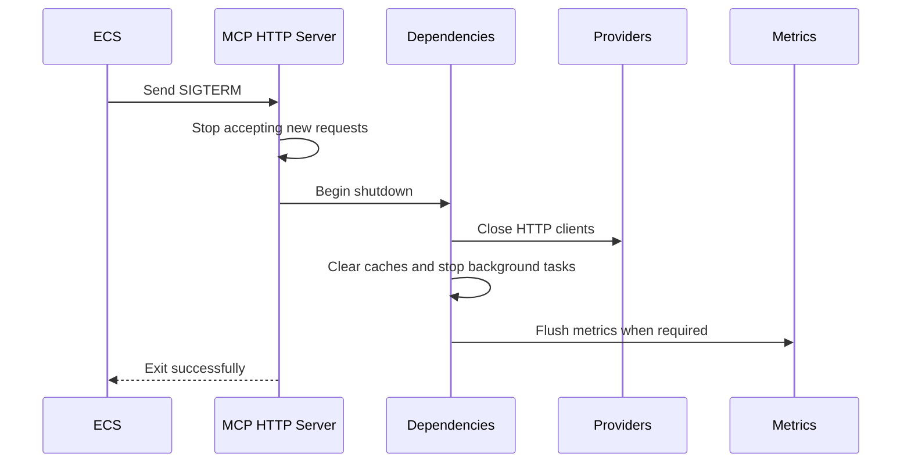

# Research Intelligence MCP — Remote Deployment PRD

**Target repository:** `research-intelligence-mcp`  
**Implementation tool:** Claude Code  
**Package namespace:** `research_intelligence_mcp`  
**Python:** 3.12  
**Remote transport:** Streamable HTTP  
**Deployment target:** AWS ECS Fargate  
**Primary client:** ResearchMind backend

---

## Document Boundary

This PRD contains the changes owned by the `research-intelligence-mcp` repository.

The companion ResearchMind repository PRD is:

```text
researchmind_mcp_integration_prd.md
```

The two PRDs together preserve the complete scope and instructions from:

```text
remote_mcp_deployment_and_researchmind_integration_prd.md
```

The MCP repository owns the remote server, transport, authentication validation, observability, containerization, AWS deployment assets, server-side smoke tests, and the server contract consumed by ResearchMind.

---

## 1. Goal

Convert the existing local stdio MCP server into a production-ready remote MCP service while preserving local stdio compatibility.

The completed system must support:

```text
Claude Desktop / Cursor / MCP Inspector
    -> stdio
    -> Research Intelligence MCP
```

and:

```text
ResearchMind Backend
    -> private Streamable HTTP + bearer JWT
    -> Research Intelligence MCP
    -> Semantic Scholar / arXiv
```

---

## 2. Deliverables

- [ ] Streamable HTTP transport
- [ ] Docker image
- [ ] Health endpoints
- [ ] JWT validation
- [ ] Correlation IDs
- [ ] Structured metrics
- [ ] ECS deployment
- [ ] MCP deployment smoke tests
- [ ] ResearchMind integration contract and handoff

## 3. Target Architecture



The first production deployment must remain private. Do not expose the MCP server directly to the public internet.

---

## 4. Implementation Rules

1. Inspect the existing repository before editing.
2. Reuse existing settings, dependency injection, logging, cache, provider, and lifecycle abstractions.
3. Preserve all existing MCP tool contracts.
4. Register tools once and reuse the same server for stdio and HTTP.
5. Keep `stdio` available for local clients.
6. Use official FastMCP APIs supported by the installed version.
7. Use Pydantic v2 settings.
8. Keep all new code asynchronous and fully typed.
9. Do not log secrets, authorization headers, API keys, or full JWTs.
10. Add unit, integration, and smoke tests.
11. Run Ruff, Mypy, Pytest, package build, and Docker build before completion.

---

# Milestone 1 — Streamable HTTP Transport

## Objective

Add remote HTTP support without removing stdio.

## Settings

Add or extend settings with:

```env
MCP_TRANSPORT=stdio
MCP_HOST=127.0.0.1
MCP_PORT=8000
MCP_PATH=/mcp
```

Supported values:

```text
stdio
streamable-http
```

Production configuration:

```env
MCP_TRANSPORT=streamable-http
MCP_HOST=0.0.0.0
MCP_PORT=8000
MCP_PATH=/mcp
```

## Required Design

Create one server factory that:

- constructs the FastMCP server;
- registers every tool once;
- receives the application dependency container;
- is reused by both transports.

The application entry point must select the transport from settings.

## Expected Commands

Local stdio:

```bash
MCP_TRANSPORT=stdio uv run python -m research_intelligence_mcp
```

Local HTTP:

```bash
MCP_TRANSPORT=streamable-http \
MCP_HOST=127.0.0.1 \
MCP_PORT=8000 \
uv run python -m research_intelligence_mcp
```

Expected endpoint:

```text
http://127.0.0.1:8000/mcp
```

## Acceptance Criteria

- [ ] Existing stdio behavior remains working.
- [ ] HTTP client can initialize an MCP session.
- [ ] Tool discovery works over HTTP.
- [ ] `health_check`, `search_papers`, and `get_paper` work over HTTP.
- [ ] Unsupported transport values fail at startup.
- [ ] Transport selection is covered by tests.

---

# Milestone 2 — Docker Image

## Objective

Create a reproducible production container.

## Required Files

```text
Dockerfile
.dockerignore
```

## Docker Requirements

- Python 3.12 slim image
- use `uv`
- install from `uv.lock`
- no development dependencies in runtime image
- multi-stage build where practical
- run as a non-root user
- use exec-form `CMD`
- set `PYTHONDONTWRITEBYTECODE=1`
- set `PYTHONUNBUFFERED=1`
- expose port 8000
- support `SIGTERM`
- include a health check
- never copy `.env` or credentials into the image

## `.dockerignore`

At minimum:

```text
.git
.github
.venv
__pycache__
.pytest_cache
.mypy_cache
.ruff_cache
dist
build
.env
.env.*
```

Do not exclude files required for package installation.

## Validation

```bash
docker build -t research-intelligence-mcp:local .
```

```bash
docker run --rm \
  -p 8000:8000 \
  --env-file .env \
  research-intelligence-mcp:local
```

## Acceptance Criteria

- [ ] Image builds from a clean checkout.
- [ ] Container runs as non-root.
- [ ] `/health` succeeds.
- [ ] `/ready` succeeds after startup.
- [ ] `/mcp` accepts authenticated requests.
- [ ] `docker stop` exits cleanly.
- [ ] No credentials exist in image layers.

---

# Milestone 3 — Health Endpoints

## Endpoints

### Liveness

```http
GET /health
```

Response:

```json
{
  "status": "healthy",
  "service": "research-intelligence-mcp",
  "version": "0.x.x"
}
```

Liveness must only verify that the process and event loop respond. It must not call Semantic Scholar or arXiv.

### Readiness

```http
GET /ready
```

Successful response:

```json
{
  "status": "ready",
  "service": "research-intelligence-mcp",
  "checks": {
    "settings": "ready",
    "dependencies": "ready",
    "providers": "ready"
  }
}
```

When unavailable:

```json
{
  "status": "not_ready",
  "service": "research-intelligence-mcp",
  "checks": {
    "dependencies": "not_ready"
  }
}
```

Status codes:

```text
200 when ready
503 when not ready
```

## Readiness Rules

Readiness may verify:

- settings loaded;
- dependency container initialized;
- provider registry initialized;
- HTTP clients initialized;
- shutdown has not begun.

Readiness must not perform live upstream provider calls.

## Authentication

- `/health` must not require JWT authentication.
- `/ready` may remain unauthenticated inside the private ECS network.
- Responses must not expose API keys, internal exceptions, or detailed configuration.

## Acceptance Criteria

- [ ] Both endpoints return JSON.
- [ ] Provider outage does not fail liveness.
- [ ] Readiness returns 503 during shutdown.
- [ ] Response schemas are tested.

---

# Milestone 4 — JWT Validation

## Objective

Protect `/mcp` with service-to-service bearer authentication.

## Authentication Flow



ResearchMind user tokens must not be forwarded as the MCP service credential.

## Required Settings

```env
MCP_AUTH_ENABLED=true
MCP_JWT_ISSUER=https://issuer.example.com/
MCP_JWT_AUDIENCE=research-intelligence-mcp
MCP_JWT_REQUIRED_SCOPE=research-intelligence/invoke
MCP_JWKS_URL=https://issuer.example.com/.well-known/jwks.json
MCP_JWKS_CACHE_TTL_SECONDS=3600
```

Authentication may be disabled only for local development and isolated tests.

## Validation Requirements

Validate:

- bearer scheme;
- token structure;
- signature;
- allowed signing algorithm;
- issuer;
- audience;
- expiration;
- not-before when present;
- required scope.

Recommended scope:

```text
research-intelligence/invoke
```

## Security Rules

- Read tokens only from `Authorization`.
- Never accept tokens in query parameters.
- Never log tokens or decoded token payloads.
- Cache JWKS keys with bounded TTL.
- Refresh keys when an unknown `kid` is encountered.
- Return generic errors.

Status behavior:

```text
401 — missing, malformed, invalid, or expired token
403 — valid token without required scope
```

## Test Cases

- [ ] missing header
- [ ] incorrect scheme
- [ ] malformed token
- [ ] expired token
- [ ] wrong issuer
- [ ] wrong audience
- [ ] missing scope
- [ ] valid token
- [ ] unknown `kid`
- [ ] health endpoints remain unauthenticated

## Acceptance Criteria

- [ ] Every production `/mcp` request is authenticated.
- [ ] Invalid requests never reach tool execution.
- [ ] A valid ResearchMind service token can list and call tools.
- [ ] No token value appears in logs.

---

# Milestone 5 — Correlation IDs

## Objective

Trace one ResearchMind operation across HTTP, MCP tools, services, provider calls, retries, and logs.

## Headers

```http
X-Request-ID: 4ab885d4-8da2-4b66-9154-30505eb44e76
X-Correlation-ID: research-session-123
```

## Rules

### Request ID

- Represents one HTTP request.
- Preserve a valid incoming value.
- Generate a UUID when absent or invalid.
- Return it in `X-Request-ID`.

### Correlation ID

- Represents a broader research operation or session.
- Preserve a safe incoming value.
- Generate one when absent or invalid.
- Return it in `X-Correlation-ID`.

## Validation

- Maximum length: 128 characters
- Reject control characters and line breaks
- Reject empty and whitespace-only values
- Prefer UUIDs or constrained URL-safe identifiers

## Implementation

Use `contextvars.ContextVar` to expose IDs to:

- HTTP middleware;
- MCP tool handlers;
- search services;
- provider executor;
- provider clients;
- cache logs;
- error logs.

Reset context variables in `finally` blocks so concurrent requests cannot leak context.

## Example Log

```json
{
  "event": "provider_request_completed",
  "request_id": "4ab885d4-8da2-4b66-9154-30505eb44e76",
  "correlation_id": "research-session-123",
  "tool": "search_papers",
  "provider": "semantic_scholar",
  "operation": "search",
  "duration_ms": 312.4,
  "status": "success"
}
```

## Test Cases

- [ ] incoming IDs preserved
- [ ] missing IDs generated
- [ ] invalid IDs replaced
- [ ] response headers returned
- [ ] IDs included in structured logs
- [ ] concurrent requests remain isolated
- [ ] context resets after success and failure

## Acceptance Criteria

- [ ] Every HTTP request has both IDs.
- [ ] Logs include IDs when request context exists.
- [ ] IDs are not used as metric labels.
- [ ] No cross-request leakage occurs.

---

# Milestone 6 — Structured Metrics

## Objective

Expose aggregate production metrics using low-cardinality labels.

## Endpoint

```http
GET /metrics
```

Use Prometheus text format when Prometheus-compatible instrumentation is selected.

The endpoint must remain private and must not be publicly exposed.

## Required Metrics

### HTTP

```text
mcp_http_requests_total
mcp_http_request_duration_seconds
mcp_http_in_flight_requests
```

Labels:

```text
method
route
status_code
```

### MCP Tools

```text
mcp_tool_requests_total
mcp_tool_duration_seconds
mcp_tool_failures_total
mcp_tool_results_total
```

Labels:

```text
tool
status
error_type
```

### Providers

```text
provider_requests_total
provider_request_duration_seconds
provider_failures_total
provider_rate_limits_total
provider_results_total
provider_retries_total
```

Labels:

```text
provider
operation
status
error_type
```

### Cache

```text
cache_hits_total
cache_misses_total
cache_writes_total
cache_evictions_total
cache_expirations_total
cache_current_entries
```

Labels:

```text
cache
```

## Prohibited Labels

Never use:

- query;
- paper title;
- abstract;
- DOI or paper ID;
- user ID;
- tenant ID;
- request ID;
- correlation ID;
- exception message;
- raw URL or query string;
- token.

## Acceptance Criteria

- [ ] Success and failure counters are updated.
- [ ] Provider latency surrounds actual provider execution.
- [ ] Cache metrics match cache state.
- [ ] Labels remain bounded.
- [ ] Metrics work without provider availability.
- [ ] Metrics are covered by tests.

---

# Milestone 7 — ECS Deployment

## Objective

Deploy the MCP server as a private AWS ECS Fargate service accessible through ECS Service Connect.

## AWS Resources

```text
ECR repository
ECS cluster
ECS task definition
ECS service
ECS Service Connect namespace
CloudWatch log group
AWS Secrets Manager secrets
IAM task execution role
IAM task role
private subnets
security groups
NAT access for provider APIs
```

## Architecture



## Service Connect

Recommended discovery name:

```text
research-intelligence-mcp
```

Recommended ResearchMind URL:

```text
http://research-intelligence-mcp:8000/mcp
```

The exact DNS suffix depends on the Service Connect namespace.

## ECS Task Requirements

- Fargate launch type
- `awsvpc` network mode
- private subnet
- no public IP
- non-root container
- CloudWatch JSON logs
- CPU and memory limits
- health check against `/health`
- graceful shutdown period
- secrets injected from Secrets Manager
- outbound HTTPS access through NAT

## Security Groups

ResearchMind service:

```text
Outbound TCP 8000 to MCP security group
```

MCP service:

```text
Inbound TCP 8000 only from ResearchMind security group
Outbound TCP 443 for provider APIs
```

Never allow:

```text
0.0.0.0/0 inbound on port 8000
```

## Deployment Sequence


## Rollback

- retain previous task definition revision;
- enable ECS deployment circuit breaker where appropriate;
- rollback when health checks fail;
- keep the previous healthy revision until the new revision is healthy.

## Acceptance Criteria

- [ ] MCP runs in private subnets.
- [ ] ResearchMind resolves the Service Connect endpoint.
- [ ] ResearchMind can call `/mcp`.
- [ ] Public internet cannot directly access the service.
- [ ] Provider outbound calls work.
- [ ] CloudWatch receives JSON logs.
- [ ] ECS replaces unhealthy tasks.
- [ ] Rollback procedure is documented.

---

# Milestone 9 — Deployment Smoke Tests

## Objective

Verify the complete deployed system.

## Level 1 — Local Container Smoke Test

Verify:

- `/health`;
- `/ready`;
- `/metrics`;
- MCP session initialization;
- tool discovery;
- authenticated tool invocation;
- graceful shutdown.

## Level 2 — ECS Smoke Test

Run from ResearchMind or another private VPC task:

1. resolve Service Connect DNS;
2. call `/health`;
3. call `/ready`;
4. obtain a service token;
5. initialize MCP;
6. list tools;
7. call `health_check`;
8. call `search_papers` with a small limit;
9. call `get_paper` for one returned paper;
10. validate response schemas;
11. verify response correlation headers;
12. verify CloudWatch logs and metrics.

## Level 3 — ResearchMind End-to-End Smoke Test

1. Start a ResearchMind research operation.
2. Invoke the ResearchMind MCP client.
3. Search Semantic Scholar and arXiv.
4. Receive canonical results.
5. Preserve structured partial failures.
6. Return results to the research runtime.
7. Confirm one correlation ID spans ResearchMind and MCP logs.

## Test Safety

- use a stable query;
- use result limit `2`;
- use strict timeouts;
- never print credentials;
- return non-zero exit status on failure;
- keep live tests separate from normal unit tests.

Suggested query:

```text
retrieval augmented generation
```

## Acceptance Criteria

- [ ] Local container smoke test passes.
- [ ] ECS staging smoke test passes.
- [ ] ResearchMind integration smoke test passes.
- [ ] Failure output is actionable.
- [ ] Commands and environment variables are documented.

---

# Graceful Shutdown

## Required Flow



## Requirements

- handle `SIGTERM`;
- stop accepting new connections;
- allow bounded completion of in-flight requests;
- return 503 from `/ready` during shutdown;
- close every provider HTTP client;
- close MCP client sessions;
- cancel background tasks;
- clear or release caches;
- make shutdown idempotent;
- continue closing resources when one close fails;
- log shutdown start and completion.

## Acceptance Criteria

- [ ] `docker stop` exits within the grace period.
- [ ] no unclosed HTTP client warnings appear.
- [ ] shutdown can safely run twice.
- [ ] readiness changes before process termination.
- [ ] lifecycle behavior is integration-tested.

---

# Sensitive Logging Rules

## Never Log

- authorization headers;
- bearer tokens;
- JWT payloads;
- cookies;
- API keys;
- raw environment variables;
- full request headers;
- user access tokens;
- raw upstream response bodies in production.

## Query Logging

Do not log complete research queries by default in production. Prefer:

```json
{
  "query_length": 148,
  "query_hash": "sha256-prefix",
  "top_k": 5
}
```

## Redaction Keys

Redact case-insensitively:

```text
authorization
proxy-authorization
cookie
set-cookie
api-key
apikey
api_key
token
access_token
refresh_token
client_secret
password
secret
semantic_scholar_api_key
```

## Error Logs

Prefer:

```text
error_type
provider
operation
retryable
status_code
```

Avoid raw exception payloads when they may contain upstream request data.

---

# Suggested Repository Changes

Adjust to the current repository rather than duplicating existing modules.

```text
src/research_intelligence_mcp/
├── main.py
├── config/
│   ├── settings.py
│   └── logging.py
├── infrastructure/
│   ├── auth/
│   │   ├── claims.py
│   │   ├── errors.py
│   │   ├── jwt_verifier.py
│   │   └── middleware.py
│   ├── observability/
│   │   ├── context.py
│   │   ├── correlation.py
│   │   ├── metrics.py
│   │   ├── middleware.py
│   │   └── redaction.py
│   └── lifecycle/
│       └── shutdown.py
├── mcp/
│   ├── server.py
│   ├── dependencies.py
│   ├── health.py
│   └── transport.py

tests/
├── unit/
├── integration/
└── smoke/

deployment/
├── ecs/
│   ├── task-definition.json
│   ├── service-connect-example.json
│   └── README.md
└── scripts/
    ├── smoke_test.py
    └── wait_for_ready.py

Dockerfile
.dockerignore
.env.example
```

The ResearchMind client files originally shown in the combined PRD belong in the companion `researchmind` repository and are defined in `researchmind_mcp_integration_prd.md`.

---

# Implementation Order

## Phase A — Remote Runtime

1. Refactor server creation into a reusable factory.
2. Add transport settings.
3. Add Streamable HTTP startup.
4. Preserve stdio startup.
5. Add health and readiness routes.
6. Add lifecycle state and graceful shutdown.

## Phase B — Security and Observability

7. Add JWT verification.
8. Protect `/mcp`.
9. Add request and correlation ID middleware.
10. Add structured metrics.
11. Add `/metrics`.
12. Add logging redaction.
13. Add tests.

## Phase C — Packaging and AWS

14. Add Dockerfile and `.dockerignore`.
15. Add local container smoke tests.
16. Add ECS task definition example.
17. Add Service Connect configuration.
18. Add Secrets Manager documentation.
19. Deploy to staging.
20. Run staging smoke tests.

## Cross-Repository Handoff

After the MCP staging endpoint and authentication contract are stable, provide the following to the ResearchMind repository:

- MCP base URL;
- Service Connect discovery name;
- JWT issuer;
- JWT audience;
- required scope;
- JWKS URL;
- supported MCP tools;
- tool input and output schemas;
- timeout guidance;
- retryable error categories;
- correlation header contract;
- smoke-test credentials and environment instructions.

The ResearchMind implementation steps numbered 21–27 in the combined PRD are preserved in the companion `researchmind_mcp_integration_prd.md`.

---

# Quality Gates

Run:

```bash
uv run ruff format --check src tests
uv run ruff check src tests
uv run mypy src
uv run pytest
uv build --no-sources
docker build -t research-intelligence-mcp:test .
```

All commands must pass before the milestone is marked complete.

---

# Definition of Done

## MCP Server

- [ ] stdio transport still works
- [ ] Streamable HTTP transport works
- [ ] `/mcp` is remotely accessible inside the private network
- [ ] `/health` works
- [ ] `/ready` works
- [ ] `/metrics` works
- [ ] JWT authentication protects `/mcp`
- [ ] required scope is enforced
- [ ] correlation IDs propagate
- [ ] structured metrics are recorded
- [ ] logs are safely redacted
- [ ] graceful shutdown is verified

## Container and AWS

- [ ] Docker image builds
- [ ] container runs as non-root
- [ ] no credentials exist in the image
- [ ] image is pushed to ECR
- [ ] ECS service is deployed privately
- [ ] Service Connect is configured
- [ ] Secrets Manager is configured
- [ ] CloudWatch logging works
- [ ] staging deployment is healthy

## Validation

- [ ] local HTTP smoke test passes
- [ ] authenticated tool call passes
- [ ] ECS staging smoke test passes
- [ ] Ruff passes
- [ ] Mypy passes
- [ ] Pytest passes
- [ ] package build passes
- [ ] Docker build passes

The ResearchMind-specific definition of done from the combined PRD is preserved in the companion ResearchMind PRD.

---

# Claude Code Final Report

After implementation, provide:

1. Files created
2. Files modified
3. Architecture decisions
4. New environment variables
5. Commands executed
6. Ruff result
7. Mypy result
8. Pytest result
9. Package build result
10. Docker build result
11. Local smoke-test result
12. ECS deployment status
13. ResearchMind integration contract status
14. Known limitations
15. Remaining manual AWS steps

---

# Final Roadmap Update

Mark the MCP repository milestone complete only after the server, container, staging ECS deployment, and MCP-side smoke tests pass.

```markdown
# Remote MCP Deployment

**Status:** ✅ Completed

## Deliverables

- [x] Streamable HTTP transport
- [x] Docker image
- [x] Health endpoints
- [x] JWT validation
- [x] Correlation IDs
- [x] Structured metrics
- [x] ECS deployment
- [x] MCP deployment smoke tests
```

The overall cross-repository milestone is complete only after the companion ResearchMind integration PRD is also complete.