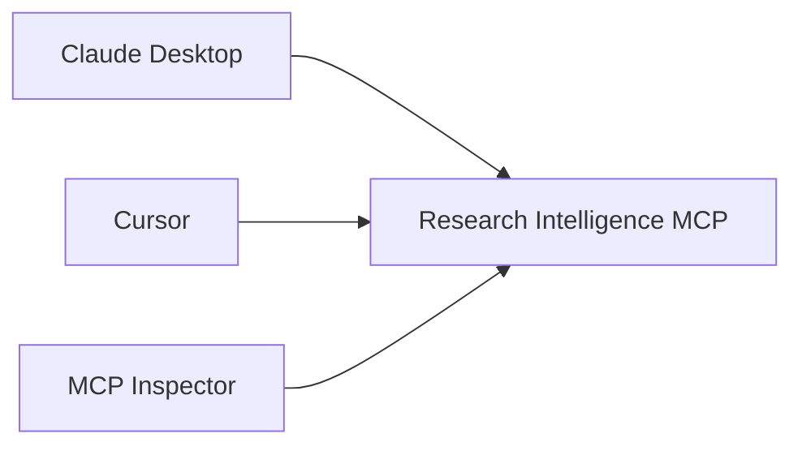
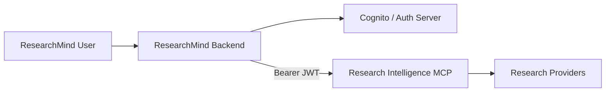
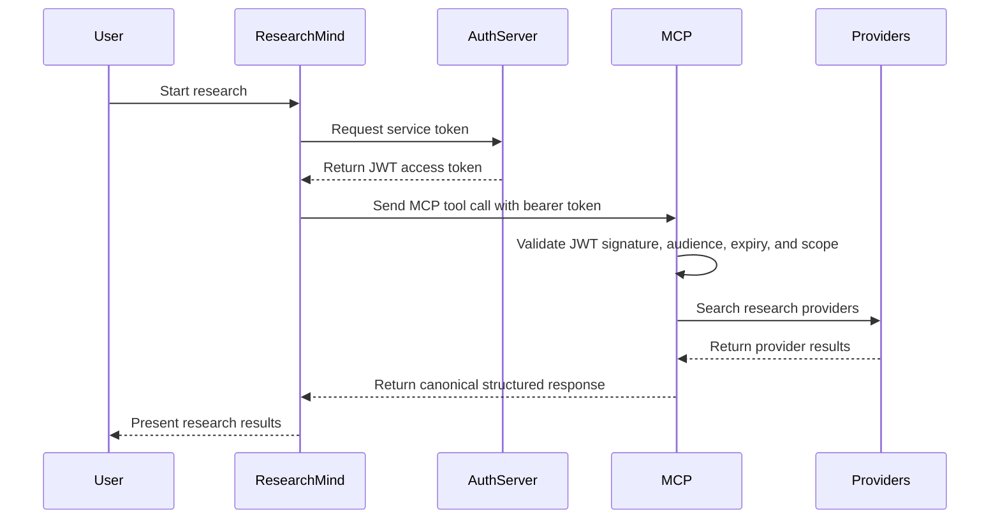
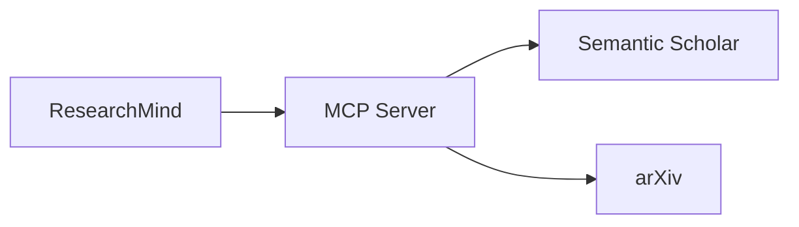
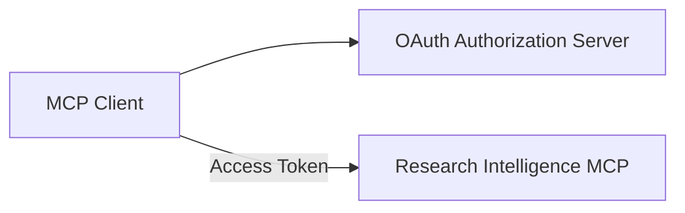

# Research Intelligence MCP Authentication Architecture

## Purpose

This document describes how authentication and authorization should work for the Research Intelligence MCP server in different deployment stages.

The project currently runs as a local stdio MCP server, but future phases require remote deployment and secure communication with ResearchMind.

## Implementation Status

| Stage | Status |
|---|---|
| Stage 1 — Local Development | Implemented (default, always on) |
| Stage 2 — ResearchMind Integration (Service JWT) | Implemented (`AUTH_*` settings, `streamable-http` transport) |
| Stage 3 — Public MCP Platform (OAuth) | Not implemented |

Stage 2 is implemented using the official MCP Python SDK's `TokenVerifier` /
`AuthSettings` extension points on `FastMCP` (bearer-JWT verification against
a trusted issuer), not a custom authentication or authorization server.
`FastMCP` still wires up an OAuth authorization-server *provider* only if one
is supplied; this project supplies a `TokenVerifier` instead, which puts the
server in resource-server-only mode. See `src/research_intelligence_mcp/
infrastructure/auth/jwt_verifier.py` and `src/research_intelligence_mcp/mcp/
server.py`.

Authentication is only enforced on the `streamable-http` transport. The
`stdio` transport (the default, per project configuration) never routes
through HTTP auth middleware, so `AUTH_*` settings have no effect there —
Stage 1 behavior is unchanged and remains the local default.

For a verified, step-by-step guide to configuring and testing Stage 2
locally (server startup, minting a test token, curl and real-MCP-client
examples, troubleshooting), see
`docs/research_intelligence_mcp_authentication_testing.md`.

---

# Authentication Evolution

| Stage | Transport | Authentication |
|--------|------------|----------------|
| Local Development | stdio | None |
| ResearchMind Integration | Streamable HTTP | Service-to-Service JWT |
| Public MCP Platform | Streamable HTTP | MCP OAuth |

---

# Stage 1 — Local Development

## Architecture



## Characteristics

- MCP process launched locally
- stdio communication
- No authentication required
- Suitable for development only
- Not intended for remote access

---

# Stage 2 — ResearchMind Integration

This is the recommended architecture for production.

---

# High-Level Architecture



---

# Why Service Authentication?

The MCP server does not need to authenticate individual users.

ResearchMind already owns:

- user authentication
- permissions
- tenants
- billing
- sessions

The MCP server only needs to know:

```text
"This request comes from the trusted ResearchMind backend."
```

---

# Recommended Flow



---

# JWT Example

## Request

```http
Authorization: Bearer eyJ...
```

---

## Claims

```json
{
  "iss": "https://auth.researchmind.ai",
  "sub": "researchmind-backend",
  "aud": "research-intelligence-mcp",
  "scope": "research-intelligence/invoke",
  "exp": 1784600000
}
```

---

# Recommended Scope Model

```text
research-intelligence/invoke
research-intelligence/search
research-intelligence/metadata
research-intelligence/admin
```

---

# User Context Propagation

The user token should NOT be forwarded directly.

Instead:

```json
{
  "request_context": {
    "user_id": "usr_123",
    "tenant_id": "tenant_1",
    "research_session_id": "res_456"
  }
}
```

This provides observability without exposing sensitive identity information.

---

# Correlation IDs

ResearchMind should generate:

```http
X-Request-ID: uuid
X-Correlation-ID: research-session-id
```

These IDs should propagate through:



---

# Stage 2 Configuration Reference

All settings are read through the same `pydantic-settings`-based `Settings`
model used elsewhere in the project (`src/research_intelligence_mcp/config/
settings.py`) and can be supplied through the environment or `.env`. See
`.env.example` for the full list with inline documentation.

| Variable | Purpose |
|---|---|
| `MCP_TRANSPORT` | Set to `streamable-http` to enable the remote transport. `stdio` (default) ignores all `AUTH_*` settings. |
| `MCP_HOST` / `MCP_PORT` | Bind address for `streamable-http`. |
| `AUTH_ENABLED` | Set to `true` to require and verify a bearer JWT on `streamable-http` requests. |
| `AUTH_ISSUER` | Expected `iss` claim. |
| `AUTH_AUDIENCE` | Expected `aud` claim, e.g. `research-intelligence-mcp`. |
| `AUTH_RESOURCE_SERVER_URL` | This server's public URL, used for OAuth protected-resource metadata. |
| `AUTH_JWT_ALGORITHMS` | Comma-separated accepted algorithms. Asymmetric algorithms (`RS256`, `ES256`, `PS256`) require `AUTH_JWKS_URL`; `HS256` requires `AUTH_JWT_SECRET`. |
| `AUTH_JWKS_URL` | JWKS endpoint used to resolve signing keys for asymmetric algorithms (production). |
| `AUTH_JWT_SECRET` | Shared secret for `HS256` verification. Intended for local and test environments only. |
| `AUTH_REQUIRED_SCOPES` | Comma-separated scopes a token must carry, e.g. `research-intelligence/invoke`. |
| `AUTH_JWT_LEEWAY_SECONDS` | Clock-skew tolerance applied to `exp`/`nbf`/`iat`. |
| `AUTH_JWKS_CACHE_TTL_SECONDS` | How long fetched JWKS signing keys are cached before a re-fetch. |

Settings validation fails fast at startup if `AUTH_ENABLED=true` but the
issuer, audience, or an applicable signing-key source is missing.

## What the server verifies

For every `streamable-http` request carrying `Authorization: Bearer <token>`,
`JWTBearerTokenVerifier` verifies, in order:

- signature, against either the JWKS endpoint (asymmetric algorithms) or the
  configured shared secret (`HS256`);
- `exp` (with configured leeway);
- `iss` matches `AUTH_ISSUER`;
- `aud` matches `AUTH_AUDIENCE`;
- `sub` is present.

Required-scope enforcement (`AUTH_REQUIRED_SCOPES`) and returning `401`/`403`
responses are handled by the MCP SDK's own `RequireAuthMiddleware`, not by
custom code in this project. Signing keys resolved from a JWKS endpoint are
fetched off the event loop and cached (bounded LRU, time-limited) by the
underlying `PyJWKClient`. No token, secret, or key material is ever logged;
only the outcome (accepted/rejected) and non-sensitive metadata (client ID,
scope count) are logged.

## Correlation IDs and user-context propagation

Every MCP tool call resolves request correlation via
`src/research_intelligence_mcp/mcp/observability.py::correlation_scope`,
which every registered tool (`health_check`, `search_papers`, `get_paper`,
`get_paper_citations`, `get_paper_references`, `get_related_papers`,
`resolve_paper_access`) wraps its body in:

- `X-Request-ID` and `X-Correlation-ID` request headers are read (via the
  MCP SDK's `Context.request_context.request`, populated for
  `streamable-http`) and bound to every structured-log line emitted while
  handling that call, including ones made by downstream provider clients.
  When a header is absent — always true under `stdio`, since there is no
  HTTP request — a `request_id` is generated so every call remains
  traceable in logs regardless of transport; `correlation_id` falls back to
  `request_id` when `X-Correlation-ID` is not supplied.
- An optional, bounded `X-Request-Context` header carries the
  `user_id` / `tenant_id` / `research_session_id` payload described above
  as JSON (max 4096 bytes). It is validated against a strict schema
  (`CallerRequestContext`); malformed, oversized, or schema-invalid values
  are logged and dropped rather than rejecting the call. Matching the
  documented design, **no raw user token is ever accepted or forwarded** —
  only these three non-identity fields are read, and only as log context,
  never returned in tool output.

## What is intentionally not implemented yet

- Structured provider metrics and a broader logging security review
  (tracked separately under Phase 7 — Reliability and Infrastructure in the
  roadmap).
- Stage 3 public OAuth (authorization-server provider, dynamic client
  registration, public API keys) — see "Not Required Yet" below.

---

# Stage 3 — Public MCP Platform

When third-party clients need direct access.

Examples:

- ChatGPT
- Claude
- Cursor
- External customers

---

# Architecture



---

# OAuth Flow

```mermaid
sequenceDiagram

    participant Client
    participant OAuth
    participant MCP

    Client->>OAuth:
        Authenticate

    OAuth-->>Client:
        Access Token

    Client->>MCP:
        Tool Request

    MCP->>MCP:
        Validate Token

    MCP-->>Client:
        Tool Response
```

---

# Recommended Timeline

## Current

```text
stdio
no auth
```

## Next

```text
Streamable HTTP
Service JWT
Private VPC
```

## Future

```text
Public HTTPS MCP
OAuth
External Clients
```

---

# Security Recommendations

## Required

- JWT signature verification
- Expiration validation
- Audience validation
- Scope validation
- HTTPS only
- Secrets Manager
- Correlation IDs
- Audit logging

---

# Not Required Yet

- User login inside MCP
- Multi-tenant authorization
- Public OAuth flows
- Per-user billing
- Public API keys