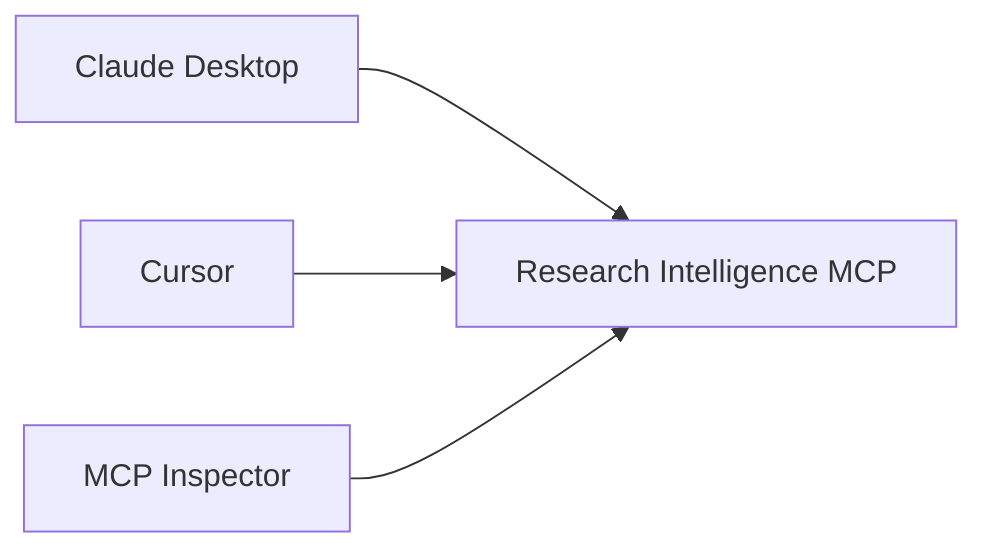
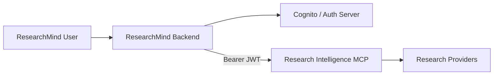
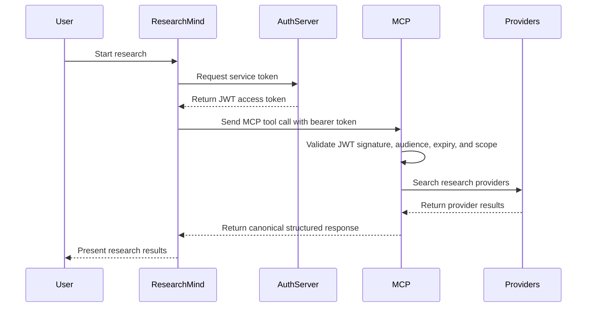
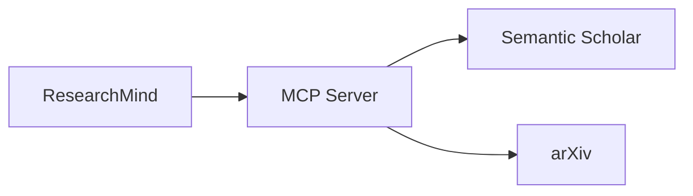
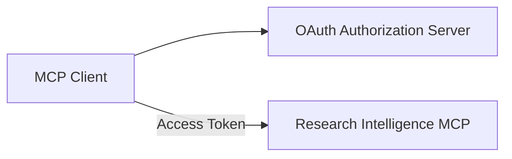

# Research Intelligence MCP Authentication Architecture

## Purpose

This document describes how authentication and authorization should work for the Research Intelligence MCP server in different deployment stages.

The project currently runs as a local stdio MCP server, but future phases require remote deployment and secure communication with ResearchMind.

---

# Authentication Evolution

| Stage | Transport | Authentication |
|--------|------------|----------------|
| Local Development | stdio | None |
| ResearchMind Integration | Streamable HTTP | Service-to-Service JWT |
| Public MCP Platform | Streamable HTTP | MCP OAuth |

---

# Stage 1 — Local Development

## Architecture



## Characteristics

- MCP process launched locally
- stdio communication
- No authentication required
- Suitable for development only
- Not intended for remote access

---

# Stage 2 — ResearchMind Integration

This is the recommended architecture for production.

---

# High-Level Architecture



---

# Why Service Authentication?

The MCP server does not need to authenticate individual users.

ResearchMind already owns:

- user authentication
- permissions
- tenants
- billing
- sessions

The MCP server only needs to know:

```text
"This request comes from the trusted ResearchMind backend."
```

---

# Recommended Flow



---

# JWT Example

## Request

```http
Authorization: Bearer eyJ...
```

---

## Claims

```json
{
  "iss": "https://auth.researchmind.ai",
  "sub": "researchmind-backend",
  "aud": "research-intelligence-mcp",
  "scope": "research-intelligence/invoke",
  "exp": 1784600000
}
```

---

# Recommended Scope Model

```text
research-intelligence/invoke
research-intelligence/search
research-intelligence/metadata
research-intelligence/admin
```

---

# User Context Propagation

The user token should NOT be forwarded directly.

Instead:

```json
{
  "request_context": {
    "user_id": "usr_123",
    "tenant_id": "tenant_1",
    "research_session_id": "res_456"
  }
}
```

This provides observability without exposing sensitive identity information.

---

# Correlation IDs

ResearchMind should generate:

```http
X-Request-ID: uuid
X-Correlation-ID: research-session-id
```

These IDs should propagate through:



---

# Stage 3 — Public MCP Platform

When third-party clients need direct access.

Examples:

- ChatGPT
- Claude
- Cursor
- External customers

---

# Architecture



---

# OAuth Flow

```mermaid
sequenceDiagram

    participant Client
    participant OAuth
    participant MCP

    Client->>OAuth:
        Authenticate

    OAuth-->>Client:
        Access Token

    Client->>MCP:
        Tool Request

    MCP->>MCP:
        Validate Token

    MCP-->>Client:
        Tool Response
```

---

# Recommended Timeline

## Current

```text
stdio
no auth
```

## Next

```text
Streamable HTTP
Service JWT
Private VPC
```

## Future

```text
Public HTTPS MCP
OAuth
External Clients
```

---

# Security Recommendations

## Required

- JWT signature verification
- Expiration validation
- Audience validation
- Scope validation
- HTTPS only
- Secrets Manager
- Correlation IDs
- Audit logging

---

# Not Required Yet

- User login inside MCP
- Multi-tenant authorization
- Public OAuth flows
- Per-user billing
- Public API keys