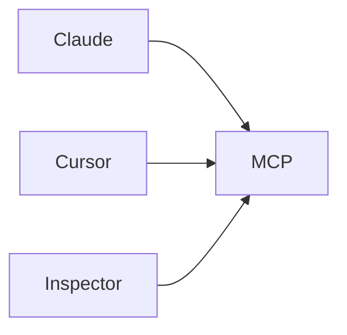
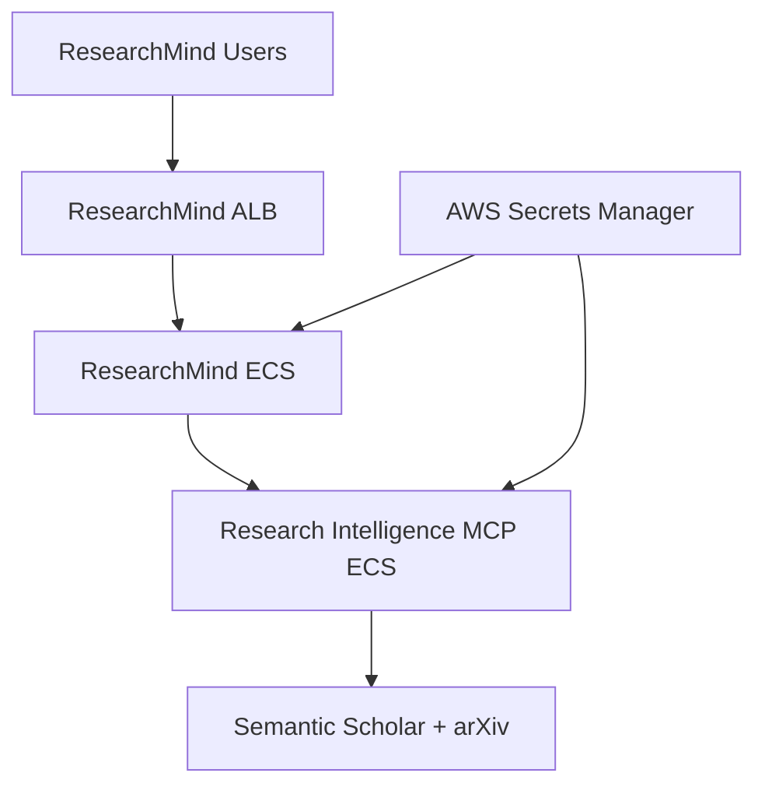
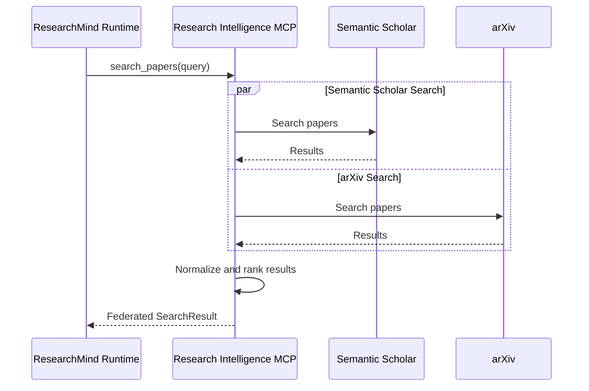
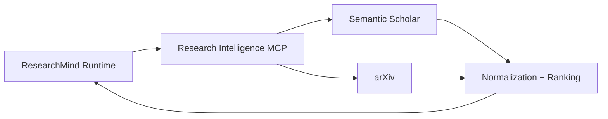
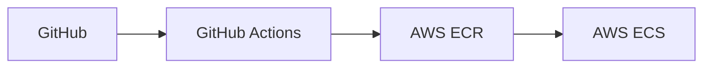
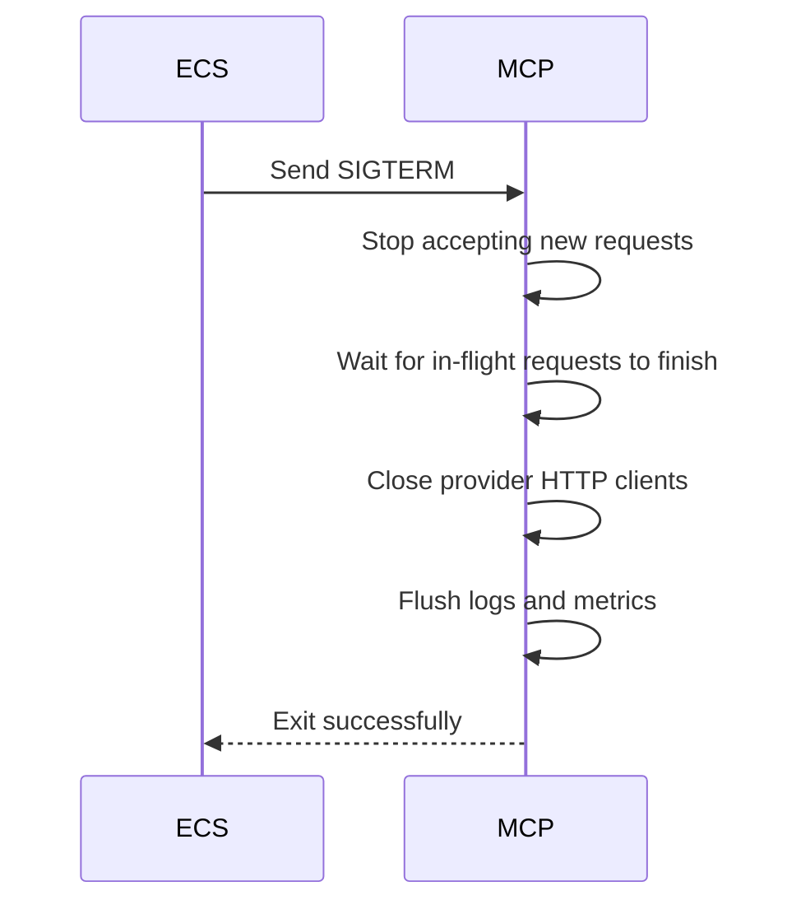
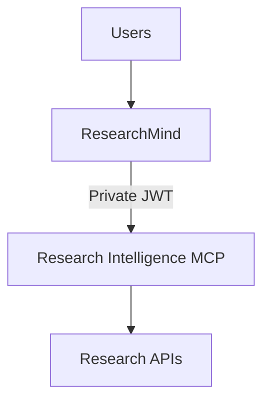

# Research Intelligence MCP Deployment Guide

## Purpose

This document describes how to deploy Research Intelligence MCP as a production service and integrate it with ResearchMind.

For the practical, current-state guide — exact commands, what has actually
been built and verified, and the remaining manual AWS steps — see
[`docs/research_intelligence_mcp_deployment_guide.md`](research_intelligence_mcp_deployment_guide.md).
This document remains the architecture and long-term vision reference.

---

# Deployment Evolution

| Stage | Deployment |
|--------|-------------|
| Development | Local stdio |
| Internal Production | Private ECS Service |
| Public Platform | Public MCP Endpoint |

---

# Current Architecture



Transport:

```text
stdio
```

This architecture cannot be consumed remotely.

---

# Production Architecture


---

# Recommended AWS Architecture



---

# Recommended Infrastructure

## Compute

```text
AWS ECS Fargate
```

Reasons:

- already used by ResearchMind
- easy scaling
- private networking
- service discovery
- simple deployment

---

# Networking

Recommended:

```text
ECS Service Connect
```

Internal endpoint:

```text
http://research-intelligence-mcp:8000/mcp
```

No public exposure required.

---

# Docker Architecture


---

# Container Structure

```text
Docker Container
│
├── Python 3.12
├── uv
├── Research Intelligence MCP
├── Configuration
└── HTTP Transport
```

---

# Runtime Architecture





---

# Required Future Phase

The current server uses:

```text
stdio
```

ResearchMind integration requires:

```text
Streamable HTTP
```

Example endpoint:

```text
POST /mcp
```

---

# Example Deployment Flow


---

# Health Endpoints

Recommended:

## Liveness

```text
GET /health
```

Response:

```json
{
  "status": "healthy"
}
```

---

## Readiness

```text
GET /ready
```

Checks:

- configuration loaded
- providers initialized
- caches initialized
- startup completed

---

# Recommended Environment Variables

```env
APP_ENV=production

MCP_TRANSPORT=http

HOST=0.0.0.0
PORT=8000

JWT_ISSUER=https://auth.researchmind.ai
JWT_AUDIENCE=research-intelligence-mcp

SEMANTIC_SCHOLAR_API_KEY=
```

---

# Secrets Management

Store:

- JWT signing configuration
- provider API keys
- future OAuth secrets

in:

```text
AWS Secrets Manager
```

Do not store secrets in:

- Docker image
- Git repository
- ECS task definitions

---

# Dockerfile Example

```dockerfile
FROM python:3.12-slim

WORKDIR /app

COPY . .

RUN pip install uv
RUN uv sync --frozen

CMD ["uv", "run", "python", "-m", "research_intelligence_mcp"]
```

Later:

```dockerfile
CMD ["uv", "run", "python", "-m", "research_intelligence_mcp.http"]
```

---

# CI/CD Flow



---

# Deployment Pipeline

```text
Push
 ↓
Lint
 ↓
Type Check
 ↓
Tests
 ↓
Build
 ↓
Security Scan
 ↓
Docker Build
 ↓
Push Image
 ↓
Deploy ECS
```

---

# Graceful Shutdown

ECS termination:



---

# Observability

Recommended metrics:

```text
provider_requests_total
provider_duration_seconds

mcp_requests_total
mcp_request_duration_seconds

cache_hits_total
cache_misses_total
```

---

# Logging

Every log should include:

```json
{
  "request_id": "",
  "correlation_id": "",
  "provider": "",
  "tool": ""
}
```

---

# Recommended Deployment Phases

## Phase 1

```text
stdio
local only
```

---

## Phase 2

```text
Private ECS Deployment
Service JWT Authentication
ResearchMind Integration
```

---

## Phase 3

```text
Public MCP Platform
OAuth
ChatGPT Integration
External Customers
```

---

# Final Recommended Architecture



---

# Immediate Next Milestones

- [x] Streamable HTTP transport
- [x] Docker image
- [x] Health endpoints
- [x] JWT validation
- [x] Correlation IDs (bound to structured logs; HTTP response-header echo not yet added)
- [x] Structured metrics
- [ ] ECS deployment (reference templates in `deployment/ecs/` are unapplied; no live AWS deployment yet)
- [ ] ResearchMind MCP client (owned by the companion ResearchMind repository)
- [x] Deployment smoke tests (local container / Level 1; ECS Level 2 and ResearchMind Level 3 pending a live deployment)

See `docs/research_intelligence_mcp_roadmap.md` Phase 7B for the full
implementation record.